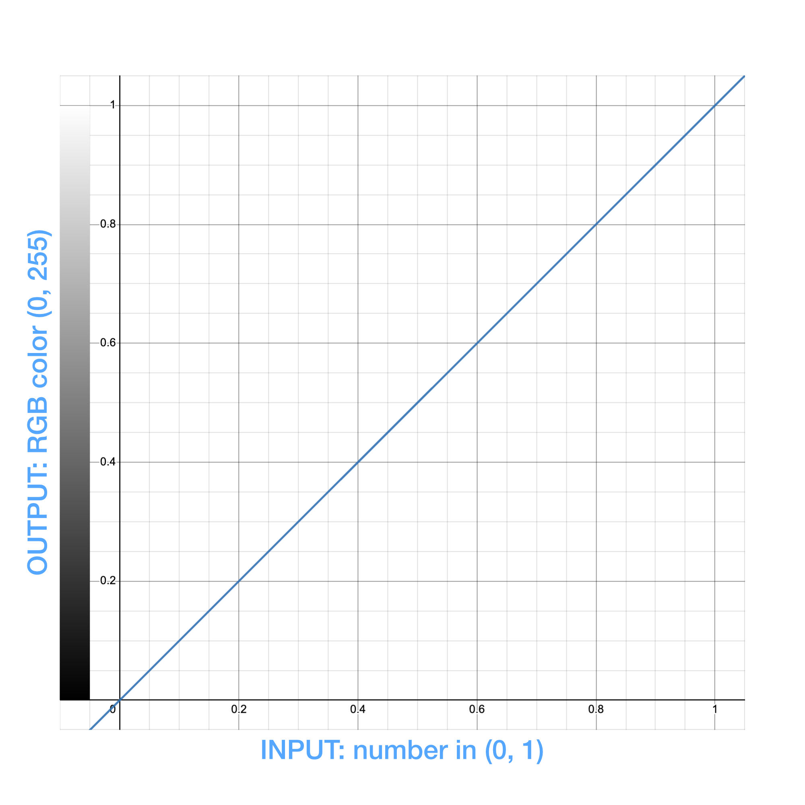
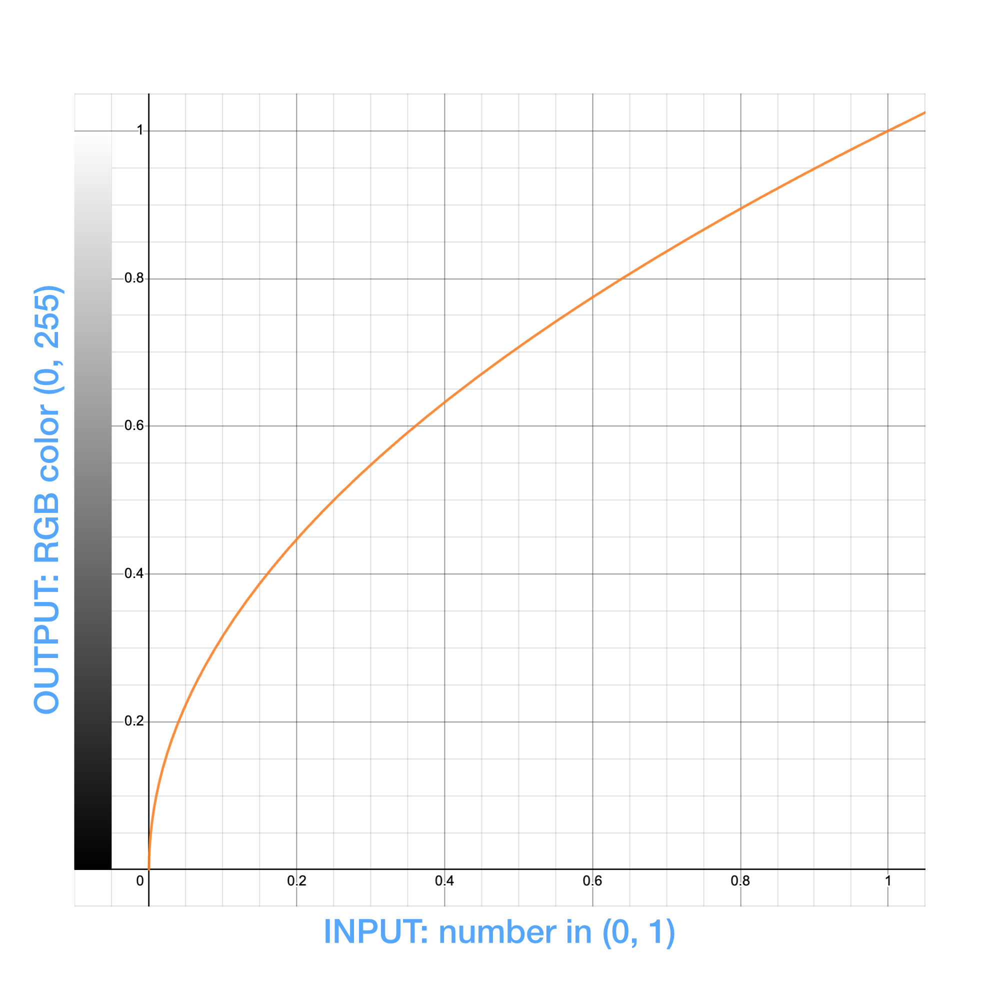
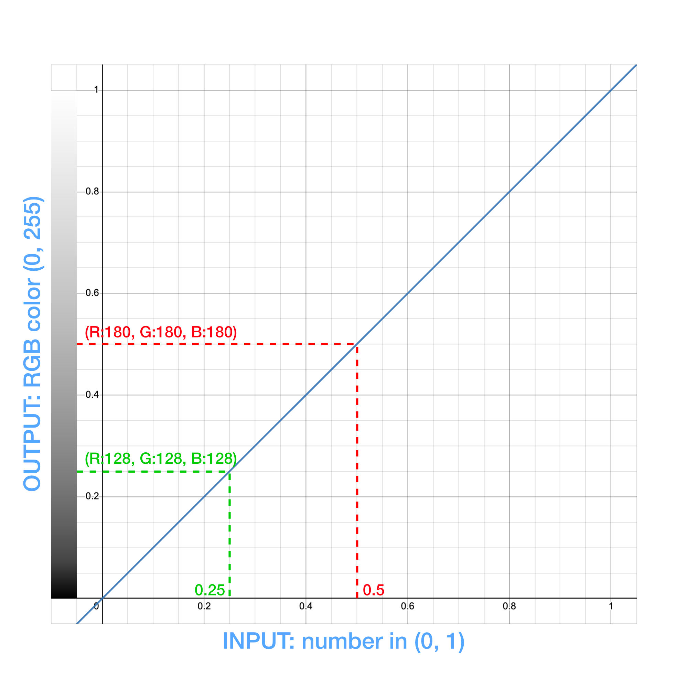
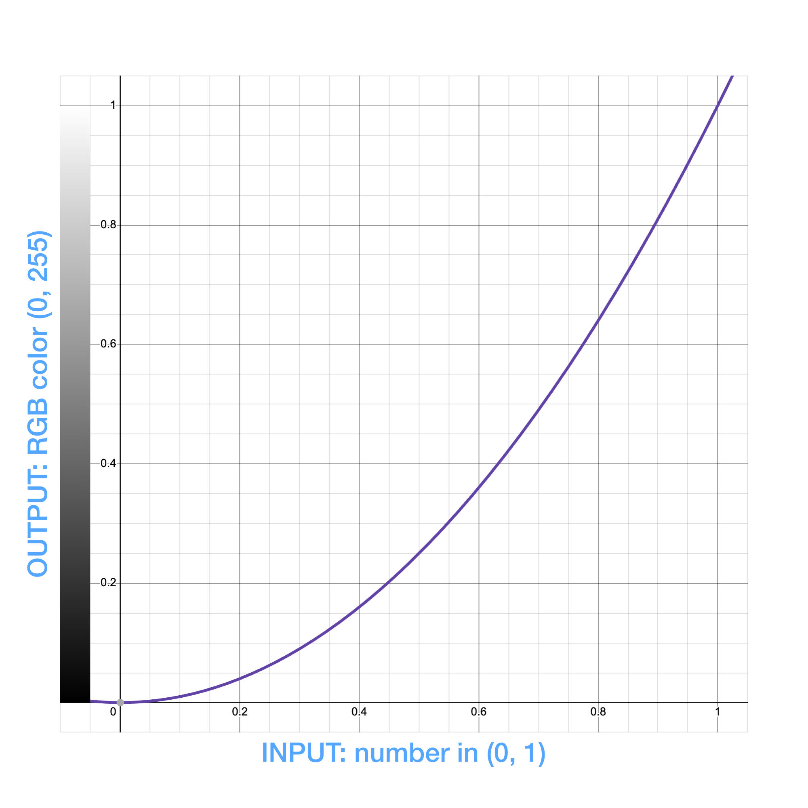
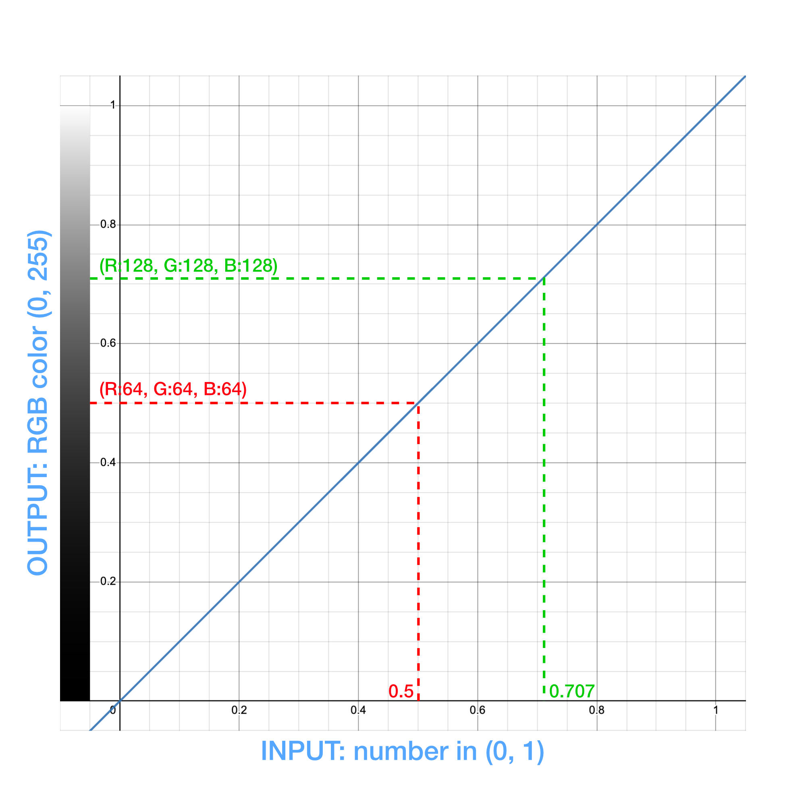

# ColorRamps resampling
`ColorRamps` in the SDK, whether they are built-in (`ColorRampCollection`) or custom made (`new ColorRamp()`) can be resampled in a non linear fashion. Such resampling can serve different purposes, for instance:
- the data to visualize follows a non-linear function
- the goal of the visualization is to specificaly emphasize difference towards the lower or upper bound of the range

Creating a non linear color ramp can be a bit difficult, so resampling an existing one that has been originaly created as linear is easier. At the moment, the SDK provides only two methods to resample a color ramp with the `.resample()` function:
- folowing a square function: `"square"`
- following a square root: `"sqrt"`

## Linear logic
All the built-in color ramps are defined in a range of `(0, 1)`. Even though they can be scaled (`.scale(min, max)`) or custom ones can be created on a diferent interval, the range of (0, 1) is the most convenient to visualize how things work. Also, to keep it simple we are using a linear gray color ramp going from `(R:0, G:0, B:0)` to `(R:255, G:255, B:255)`. You can find this specific one as `ColorRampCollection.GRAY`.



- along the `x` axis (horizontal), the input number. This can be the intensity or any real-worl metric
- along the `y` axis (vertical), the output color

As we can see:
- an input of `0` will yied the color `(R:0, G:0, B:0)`
- an input of `0.5` will yied the color `(R:127, G:127, B:127)`
- an input of `1` will yied the color `(R:255, G:255, B:255)`

The original linear GRAY color ramp looks like this:


## *sqrt* method
To resample a color ramp with the *square root* method, simply do:
```ts
const graySqrt = ColorRampCollection.GRAY.resample("sqrt");
```

Note: this will **not** modify the origin `ColorRampCollection.GRAY`.

There are multiple ways to visualize the effect of such resampling. The simplest is probably to do as above (*linear logic*), but using a *square root* function:



This will yield the following color ramp:


If we compare with the linear GRAY from above, we can see that the lower part (the darkest) is sort of compressed, while the upper part (the lightest) looks stretched.

As a result:
- an input of `0` will yied the color `(R:0, G:0, B:0)`
- an input of `0.5` will yied the color `(R:180, G:180, B:180)`
- an input of `1` will yied the color `(R:255, G:255, B:255)`

Another way to look at the *sqrt-resampled* GRAY color ramp is by using it along the `y` axis and addressing it with data that are following a linear rule:


This can be convenient to do if the purpose is to emphasize the change of values on the lower-end, say in the range `(0, 0.4)` as the color response will be faster-changing than with a linear scale.

## *square* method
To resample a color ramp with the *square* method, simply do:
```ts
const graySquare = ColorRampCollection.GRAY.resample("square");
```

Note: this will **not** modify the origin `ColorRampCollection.GRAY`.

Let's visualize it, using the original linear gradient along the `y` axis:



This will yield the following color ramp:


As we can see, compared to the linear ramping, the change is color is slower towards the lower end and faster towards the end of the range.

As a result:
- an input of `0` will yied the color `(R:0, G:0, B:0)`
- an input of `0.5` will yied the color `(R:64, G:64, B:64)`
- an input of `1` will yied the color `(R:255, G:255, B:255)`

Again, we can visualize a *square-resampled* color ramp by using it alongside the `y` axis, with linear data:



Contrary to the *sqrt* method, the *square* will yield faster changing colors on the upper bound of the input range.