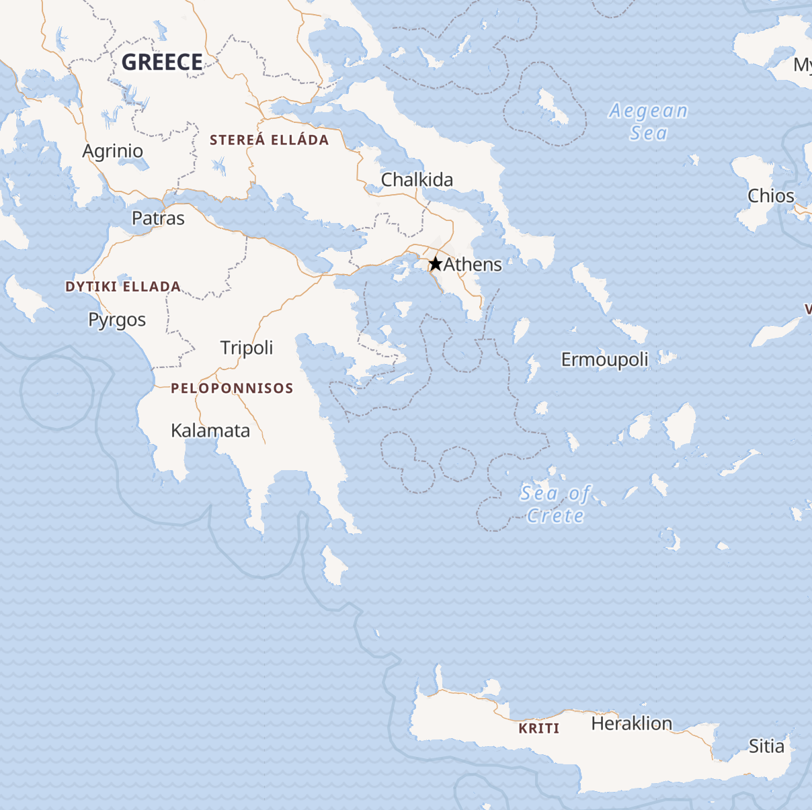
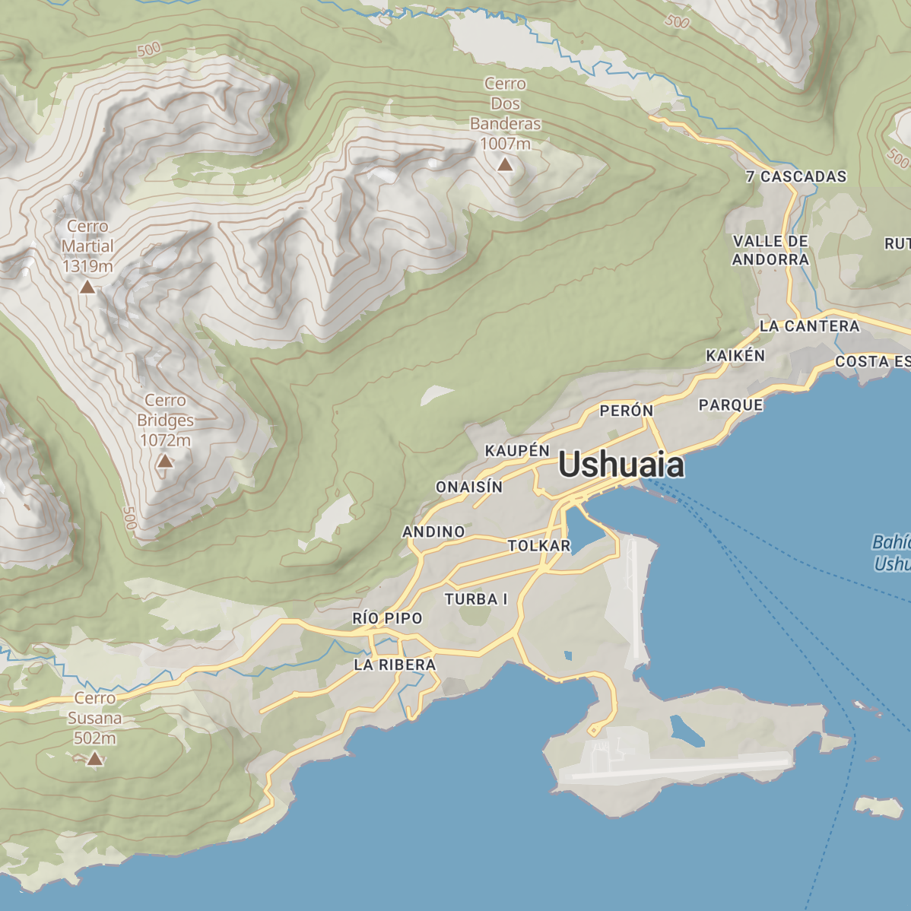
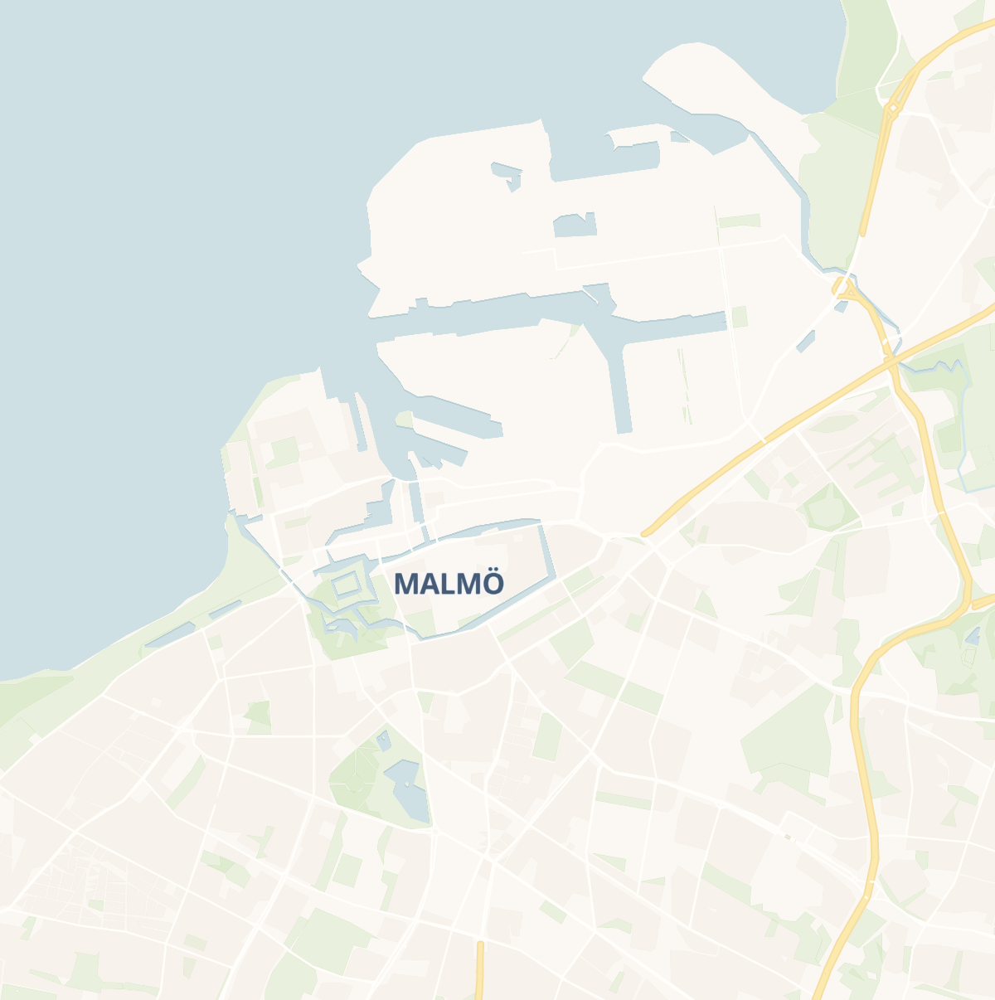
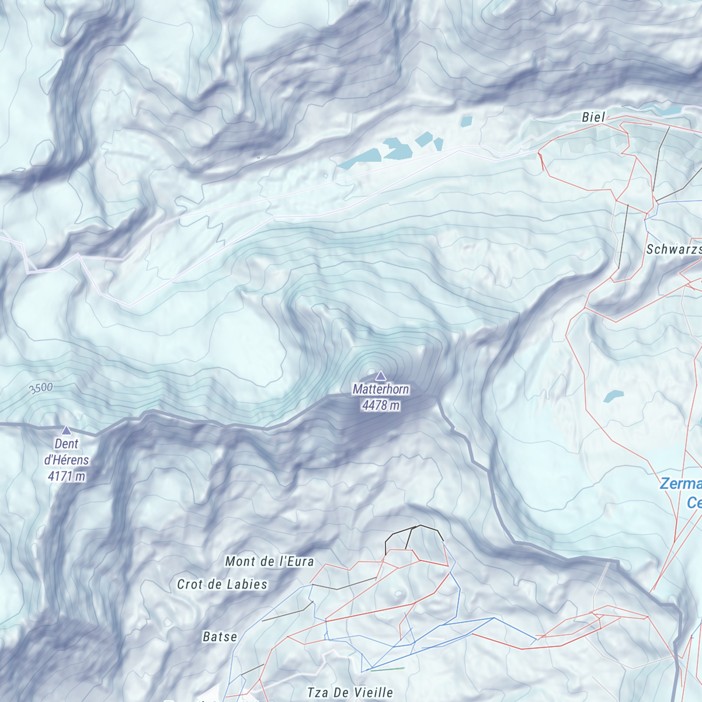

<p align="center">
  
</p>

<p align="center" style="color: #AAA">
  The frontend map SDK tailored for MapTiler Cloud
</p>

<p align="center">
  
  
</p>

<p align="center">
  </img>
  </img>
  
</p>

# Install
```shell
npm install --save @maptiler/sdk
```

# Quick start
```ts
import * as maptiler from 'maptiler';

// Add your MapTiler Cloud API key to the config
// (Go to https://cloud.maptiler.com/account/keys/ to get one for free!)
maptiler.config.apiKey = 'YOUR_API_KEY';

// In React, you can use a Ref to a div and use it as a container
const mapContainer: React.RefObject<HTMLElement> = React.createRef();

// Instanciate the map
const map = new maptiler.Map({
    container: mapContainer,
});
```
By default, the map will be initialized with the style [streets-v2](https://www.maptiler.com/maps/#style=streets-v2).

# Many styles to choose from
<p align="center">
  </img>
  </img>
  </img>
  </img>
  </img>
  </img>
  </img>
  </img> 
  </img>
  </img>
  </img>
  </img>
  </img>
  </img>
</p>

In addition to your custom styles, MapTiler Clouds comes with many styles that are easy to configure from the SDK:

```ts
map.setStyle('outdoor');
```

You can choose from the following:
- `basic-v2`
- `bright`
- `openstreetmap`
- `outdoor`
- `pastel`
- `hybrid`
- `streets-v2`
- `toner`
- `topo`
- `topographique`
- `voyager`
- `winter`
- `streets-v2-dark`
- `streets-v2-light`

# Easy language switching
The language gnerally depends on the style but we made it possible to easily update it with a single function and from a built-in list of languages:

```ts
map.setLanguage(maptiler.languages.ENGLISH);
```

The special languages `maptiler.languages.LATIN` and `maptiler.languages.NON_LATIN` are generally the default ones in the styles developped by the MapTiler team and they are generaly safe all-around fallbacks.  

Some style, developped inhouse as well as by the community, may have a support for a secondary language. In this case, you can also update the second language:

```ts
map.setSecondaryLanguage(maptiler.languages.NON_LATIN);
```

Also, note that `.setLanguage()` is shorthand for `.setPrimaryLanguage()`.


# Built-in support for right-to-left languages
Languages that are written right-to-left such as arabic and hebrew are fully supported by default. No need to install any plugin!

<p align="center">
  </img>
  </img>
</p>

# Easy access to MapTiler Cloud API
A map SDK is not only about maps! Here is the list of service wrapper functions that are built-in:

## 🔍 Geocoder
### Forward
You want to know the longitude and latitude of a specific place, use the forward geocoder:
```ts
// in an async function, or as a 'thenable':
const result = await maptiler.geocoder.forward('paris');
```
You can provide some options such as:
- the proximity, given a lon-lat position, to sort the results
- one of more languages to get the results into
- a bounding geo box, to restrict the search to a given window

Read more about forward geocoding on our official [API documentation](https://docs.maptiler.com/cloud/api/geocoding/#search-by-name-forward).

### Reverse
You wan to tknow the name of a place, given a longitude-latitude? Then use the reverse geocoding:
```ts
// in an async function, or as a 'thenable':
const result = await maptiler.geocoder.reverse({ lng: 6.249638, lat: 46.402056 });
```
The same option object as the forward geocoding can be provided.

Read more about reverse geocoding on our official [API documentation](https://docs.maptiler.com/cloud/api/geocoding/#search-by-coordinates-reverse).

## 🕵️‍♂️ Geolocation
The geolocation service provides an accurate location insight of a website visitor, using it's IP address.

There is only a single function:
```ts
// in an async function, or as a 'thenable':
const result = await maptiler.geolocation.info();
```

Read more about geolocation on our official [API documentation](https://docs.maptiler.com/cloud/api/geolocation/).

## 🌐 Coordinates
If you are already familiar with [epsg.io](https://epsg.io/) (created by MapTiler), then you may find convenient to access the details of more than 10 thousands of coordinate reference system (CRS) programmatically, as well as transforming coordinates from a system to another!
### Search
The `search` lets you perform a query in a free form fashion. Here are some examples:
```ts
// in an async function, or as a 'thenable':
const resultA = await maptiler.coordinates.search('mercator');
const resultB = await maptiler.coordinates.search('plate carree');
const resultC = await maptiler.coordinates.search('france');
const resultD = await maptiler.coordinates.search('code:4326');
```

Read more about searching coordinate systems on our official [API documentation](https://docs.maptiler.com/cloud/api/coordinates/#search-coordinate-systems).

### Transform
Transforming a coordinate from one system to another can be challenging, for example, most countries have their own official system, yet web mapping tools are more often than not exclusive to [WGS84](https://epsg.io/4326).

If not provided, both the source (`sourceCrs`) and the destination (`targetCrs`) are default to **EPSG:4326** (in other words, [WGS84](https://epsg.io/4326)). Here is how to use this feature:
```ts
// in an async function, or as a 'thenable':

// Providing one coordinate to transform, with a target CRS being EPSG:9793 (RGF93 v2 / Lambert-93, France official CRS)
const resultA = await maptiler.coordinates.transform({lng: 1, lat: 45}, {targetCrs: 9793})

// Using the same logic, we can pass up to 50 cooridinates to be transformed
const resultB = await maptiler.coordinates.transform([{lng: 10, lat: 48}, {lng: 1, lat: 45}], {targetCrs: 9793})
```

## 💽 Data
MapTiler Cloud give its users the possibility to [upload or create data](https://cloud.maptiler.com/data/), manually with a user interface or by uploading a GPX, GeoJSON, KML or shp file. A unique ID is given to each dataset so that we can later on access it programmatically to retrieve a GeoJSON equivalent:

```ts
// in an async function, or as a 'thenable':
const result = await maptiler.data.get('my-dataset-unique-id')
```

Since the result is a GeoJSON, it can easily be added to a `map` with `.addSource()` and `.addLayer()`.

## 🗺️ Static maps
TODO