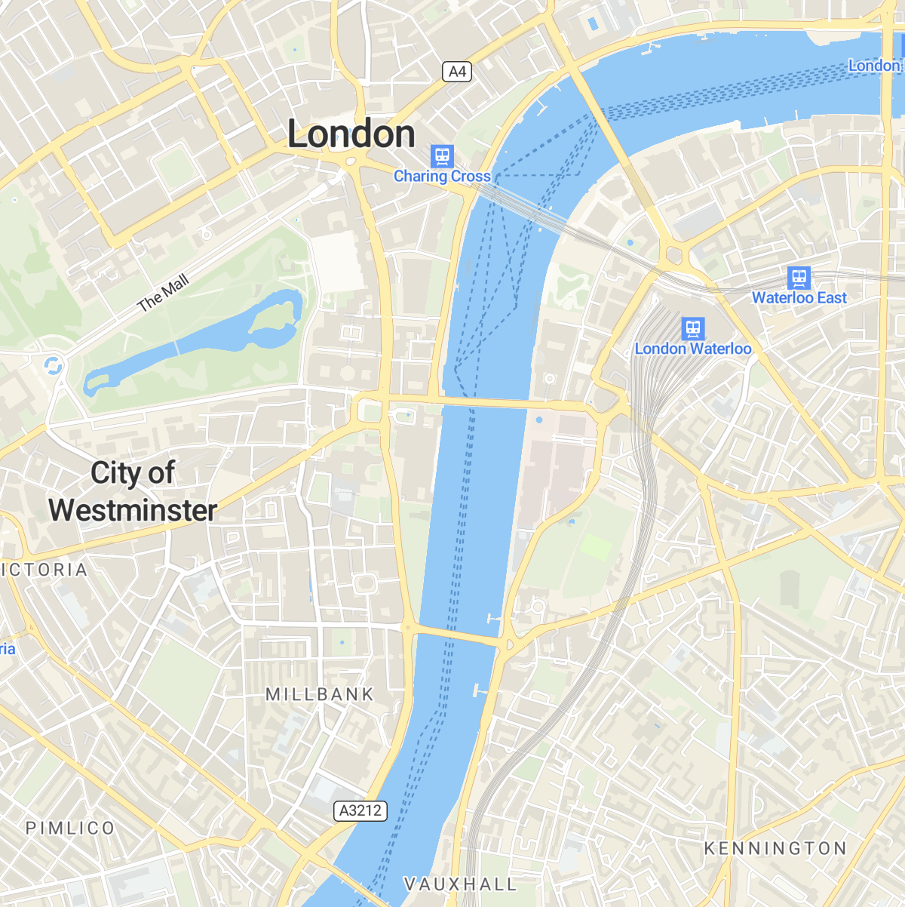
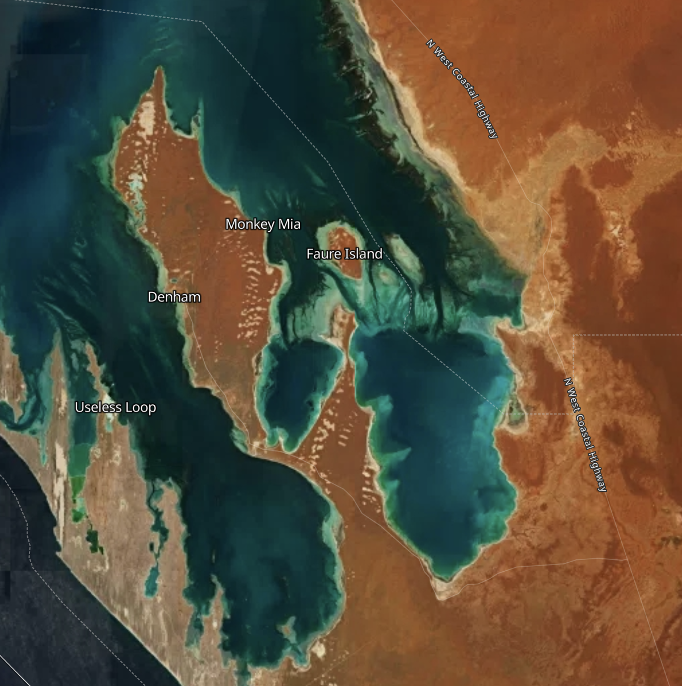
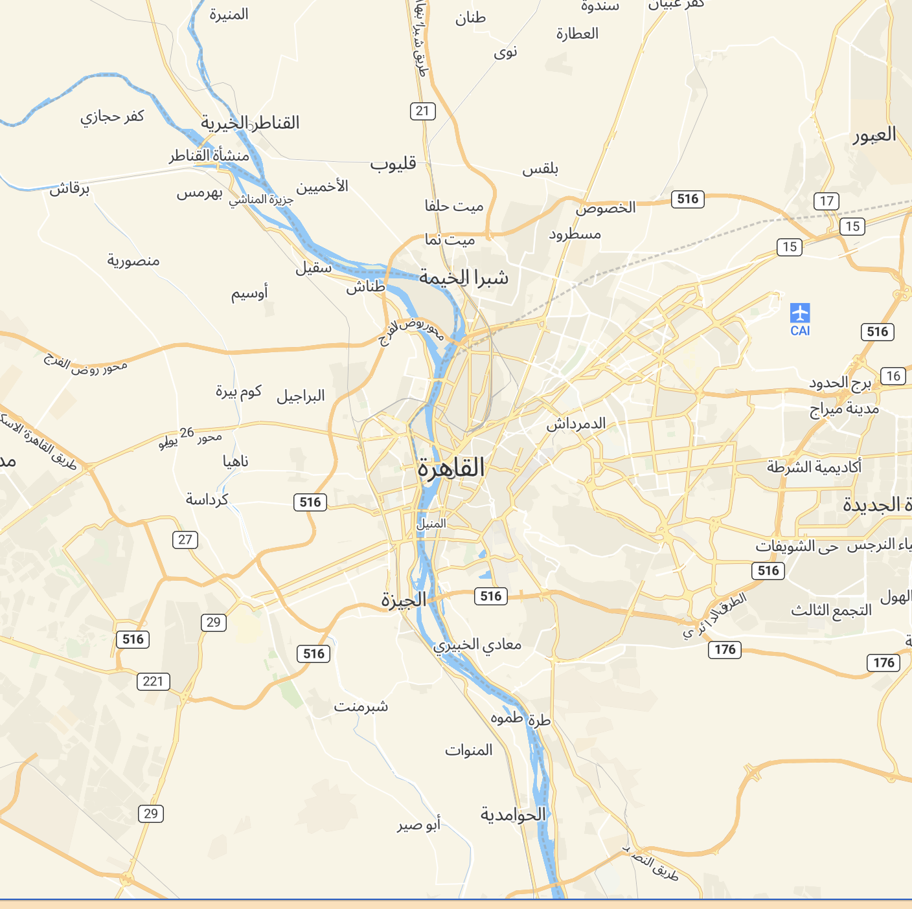

<p align="center">
  
</p>

<p align="center" style="color: #AAA">
  The Javascript & TypeScript map SDK tailored for <a href="https://www.maptiler.com/cloud/">MapTiler Cloud</a>
</p>

<p align="center">
  
  
  </img>
  </img>
</p>

# What and why?
The **MapTiler SDK JS** extends MapLibre GL JS, exposes all its features, and adds new ones on top. The SDK is designed to work with the well-established  [MapTiler Cloud service](https://www.maptiler.com/cloud/), which provides all the data required to fuel a complete web mapping experience: vector tiles, satellite raster tiles, DEM with Terrain RGB, custom styles with an editor, etc.  

**Why are we creating a new SDK?** To make things simpler for developers working in the MapTiler ecosystem! With **MapTiler SDK JS**, there is no need to load external plugins for the most basic things, copy-paste complex data source URLs, or look up the syntax to enable 3D terrain every time you start a project. All this is built-in, loaded when needed, or exposed with simple functions. Under the hood, this SDK is opinionated as it's being fed by [MapTiler Cloud](https://www.maptiler.com/cloud/) data, but its MapLibre core makes it 100% compatible with other sources.  

In addition, the MapTiler SDK JS provides well-documented and easy-to-use wrapper functions to the [MapTiler Cloud API services](https://docs.maptiler.com/cloud/api) such as: geocoding, static maps, geolocation, as well as a search engine for coordinate reference systems and transforming coordinates from one CRS to another.
> 📣 *__Note:__* If you need <ins>only the API Client library</ins> to use in a headless fashion and without any map display, check out [MapTiler Client JS](https://github.com/maptiler/maptiler-client-js) library for browser and NodeJS.

# Install
```shell
npm install --save @maptiler/sdk
```

# API documentation
In addition to the details and examples provided in this readme, check out the [complete API documentation](https://maptiler.github.io/maptiler-sdk-js) (see the [Markdown version](docsmd/README.md))

# Quick start

## With ES modules
**Recommended for:** advanced applications

```ts
import * as maptilersdk from '@maptiler/sdk';

// Add your MapTiler Cloud API key to the config
// (Go to https://cloud.maptiler.com/account/keys/ to get one for free!)
maptilersdk.config.apiKey = 'YOUR_API_KEY';

// Let's say you have a DIV ready to receive a map
const mapContainer = document.getElementById('my-container-div');

// Instanciate the map
const map = new maptilersdk.Map({
  container: mapContainer,
});
```
By default, the map will be initialized with the style [streets-v2](https://www.maptiler.com/maps/#style=streets-v2).

Depending on the framework and environment your are using for your application, you will have to also include the CSS file. 

For example, with a [NextJS](https://nextjs.org/) app, this can take place at the top of the file `_app.ts/js`:
```ts
import "@maptiler/sdk/dist/maptiler-sdk.css";
```


## With CDN
The SDK hosted on our CDN is bundled as *[Universal Module Definition](https://github.com/umdjs/umd)* (UMD) to make it standalone and containing all its dependencies. The CDN also serves the style sheet (css).

**Recommended for:** simple map intergration example and demos

```html
<html>
  <head>
    <title>MapTiler JS SDK example</title>
    <style>
      html, body {
        margin: 0;
      }

      #map-container {
        position: absolute;
        width: 100vw;
        height: 100vh;
      }
    </style>

    <!-- Load the SDK CSS -->
    <link rel="stylesheet" href="dist/maptiler-sdk.css">
  </head>

  <body>
    <div id="map-container"></div>
  
    <script src ="dist/maptiler-sdk.umd.js"></script>
    
    <script>
      // Add your MapTiler Cloud API key to the config
      // (Go to https://cloud.maptiler.com/account/keys/ to get one for free!)
      maptilersdk.config.apiKey = 'YOUR_API_KEY';

      const mapContainer = document.getElementById('my-container-div');

      const map = new maptilersdk.Map({
        container: mapContainer,
        style: maptilersdk.MapStyle.STREETS_DARK,
        hash: true,
      })
    </script>
  </body>
</html>
```
Checkout the minimalist code samples in the [demos](demos) directory.


# Many styles to choose from
MapTiler teams maintains a few styles that we have decided to expose from the SDK. This has two advantages:
- they are easier to remember, no need to type along style URL
- if we make an update to a style, you will benefit from it without modifying your codebase

Here is how it works:
```ts
import { Map, MapStyle } from '@maptiler/sdk'

// When instanciating a map
const map = new Map({
  container: document.getElementById("my-container-div"),
  style: MapStyle.OUTDOOR, // <-- the shorthand for the outdoor style
});

// Or later on, updating the style
map.setStyle(MapStyle.STREETS.DARK);
```

The styles with a shorthand provided by the SDK are the following:

| ID | Screenshot | Comment |
|:-:|:-:|:-:|
|`MapStyle.STREETS`|[](https://www.maptiler.com/maps/#style=streets-v2&mode=2d&position=12.52/40.73676/-73.98418)|The classic default style, perfect for urban areas|
|`MapStyle.STREETS.DARK`|[](https://www.maptiler.com/maps/#style=streets-v2-dark&mode=2d&position=3.71/39.66/-99.05)|A dark theme perfect to display data layers on top without losing any precious information|
|`MapStyle.STREETS.LIGHT`|[](https://www.maptiler.com/maps/#style=streets-v2-light&mode=2d&position=4.4/48.15/12.65)|Just like the `STREETS.DARK`, but in bright mode! Your data layer as a first class citizen!|
|`MapStyle.SATELLITE`|[](https://www.maptiler.com/maps/#style=hybrid&mode=2d&position=7.87/24.518/-77.411)|Only high resolution satellite raster tiles without any labels|
|`MapStyle.HYBRID`|[](https://www.maptiler.com/maps/#style=hybrid&mode=2d&position=9.4/-26.175/122.6631)|Satellite tile with labels, landmarks, roads ways and political borders|
|`MapStyle.OUTDOOR`|[](https://www.maptiler.com/maps/#style=outdoor&mode=2d&position=11.96/46.02591/7.7273)|A solid hiking companion, with peaks, parks, isolines and more|
|`MapStyle.BASIC`|[](https://www.maptiler.com/maps/#style=basic-v2&mode=2d&position=13.09/37.78734/-122.42025)|A minimalist alternative to `STREETS`, with a touch of flat design|


<details>
  <summary>Know more about built-in map styles</summary>

MapTiler provides some **reference styles** as well as some **variants** for each. A **reference syle** sets some guidelines about what kind of information is displayed, the granularity of the information, and more generaly defines a purpose for which this style is the most relevant: street navigation, outdoor adventure, minimalist dashboard, etc. Then, each **reference style** offers a range of **variants** that contain the same level of information and has the same purpose but using different colors schemes.

Here is the full list:
- `MapStyle.STREETS`, reference style for navigation and city exploration
  - `MapStyle.STREETS.DARK` (variant)
  - `MapStyle.STREETS.LIGHT` (variant)
  - `MapStyle.STREETS.PASTEL` (variant)
- `MapStyle.OUTDOOR` reference style for adventure
- `MapStyle.WINTER` reference style for winter adventure
- `MapStyle.SATELLITE` reference style satellite and airborne imagery (no variants)
- `MapStyle.HYBRID` reference style satellite and airborne imagery with labels (no variants)
- `MapStyle.BASIC` reference style for minimalist design and general purpose
  - `MapStyle.BASIC.DARK` (variant)
  - `MapStyle.BASIC.LIGHT` (variant)
- `MapStyle.BRIGHT` reference style for high contrast navigation
  - `MapStyle.BRIGHT.DARK` (variant)
  - `MapStyle.BRIGHT.LIGHT` (variant)
  - `MapStyle.BRIGHT.PASTEL` (variant)
- `MapStyle.TOPO` reference style for topographic study
  - `MapStyle.TOPO.SHINY` (variant)
  - `MapStyle.TOPO.PASTEL` (variant)
  - `MapStyle.TOPO.TOPOGRAPHIQUE` (variant)
- `MapStyle.VOYAGER` reference style for stylish yet minimalist maps
  - `MapStyle.VOYAGER.DARK` (variant)
  - `MapStyle.VOYAGER.LIGHT` (variant)
  - `MapStyle.VOYAGER.VINTAGE` (variant)
- `MapStyle.TONER` reference style for very high contrast stylish maps 
  - `MapStyle.TONER.BACKGROUND` (variant)
  - `MapStyle.TONER.LITE` (variant)
  - `MapStyle.TONER.LINES` (variant)
- `MapStyle.OPENSTREETMAP` (reference style, this one does not have any variants)

All reference styles (instances of `ReferenceMapStyle`) and style variants (instances of `MapStyleVariant`) have methods to know the alternative styles and variant that belong to the same reference style (`.getVariants()`). This is handy to provide a default/dark/light alternative color scheme, yet preserving the same level of details as in the reference style. Read more about about [ReferenceMapStyle](docsmd/classes/ReferenceMapStyle.md) and [MapStyleVariant](docsmd/classes/MapStyleVariant.md).
</details>  

___


Still, you can still use some classic styles with just a *string* if you know their MapTiler CLoud ID:

```ts
map.setStyle('outdoor-v2');
```

And finally, you can use your own custom styles designed with [our style editor](https://cloud.maptiler.com/maps/). Every custom style is given a unique ID, for instance: `c912ffc8-2360-487a-973b-59d037fb15b8`.

This ID can be provided as such:
```ts
map.setStyle("c912ffc8-2360-487a-973b-59d037fb15b8");
```

Or in its extended form:
```ts
map.setStyle("https://api.maptiler.com/maps/c912ffc8-2360-487a-973b-59d037fb15b8/style.json");
// this could be suffixed with the API token as well
```

And can even be provided in the URI form:
```ts
map.setStyle("maptiler://c912ffc8-2360-487a-973b-59d037fb15b8");
```

# Easy to add controls
The term "control" is commonly used for all sorts of button and information display that takes place in one of the corner of the map display area. The most well know are probably the `[+]` and `[-]` zoom button as well as the attribution. Plenty of others are possible and we have made them easy to add and directly accessible from the `Map` constructor options!

The options are:
- `navigationControl`
  - Shows the `[+]`, `[-]` and tilt/bearing/compass buttons
  - a boolean or a corner position. Showing on the top-right by default. Hidden if `false`.
- `terrainControl`
  - Shows a button to enable/disable the 3D terrain (does not tilt the map)
  - a boolean or a corner position. Showing on the top-right by default. Hidden if `false`.
- `scaleControl`
  - Shows a distance scale. The unit (`"metric"`, `"imperial"` or `"nautical"`) can be set in the config object `config.unit` (default: `"metric"`)
  - a boolean or a corner position. Hidden by default, showing on bottom-right if `true`.
- `fullscreenControl`
  - Shows a button that toggles the map into fullscreen
  - a boolean or a corner position. Hidden by default, showing on top-right if `true`.

The corner positions possible are:
The corner positions possible are:
- `"top-left"`
- `"top-right"`
- `"bottom-left"`
- `"bottom-right"`

**Example:**  
```ts
import { Map } from "@maptiler/sdk";

const map = new Map({
  container: document.getElementById("my-container-div"),
  terrainControl: false,
  scaleControl: true,
  fullscreenControl: "top-left",
})
```


# 3D terrain in one call
<p align="center">
  </img>
  </img>
</p>


You want to enable 3D terrain? That's easy now with a single function call:
```ts
// With the default exaggeration factor of 1
map.enableTerrain();

// Or, if you want to boost some volume a little
map.enableTerrain(1.5);
```

The terrain can also be enabled directly from the `Map` constructor, with the options `terrain` (a boolean, `false` by default) and `terrainExaggeration` (a number, `1` by default):

```ts
const map = new Map({
  // some options...
  terrain: true,
  terrainExaggeration: 1.5,
})
```

At any point, you can modify the exaggeration factor:
```ts
map.setTerrainExaggeration(2);
```

Or simply disable it:
```ts
map.disableTerrain()
```

> 📣 *__Note:__* Keep in mind that setting an exaggeration factor at `0` will result in a the same result as disabling the elevation but that terrain RGB tiles will still be fetched in the background.

> 📣 *__Note 2:__* please be aware that due to the volume and elevation of the map floor in 3D space, the navigation with the terrain enabled is slightly different than without.


# Easy language switching
The language generally depends on the style but we made it possible to easily update it with a single function and from a built-in list of languages:

```ts
map.setLanguage(maptilersdk.Language.ENGLISH);
```

The special languages `maptilersdk.Language.LATIN` and `maptilersdk.Language.NON_LATIN` are generally the default ones in the styles developped by the MapTiler team and they are generaly safe all-around fallbacks.  

Some style, developped in-house as well as by the community, may support a secondary language. In this case, you can also update it:

```ts
map.setSecondaryLanguage(maptilersdk.Language.NON_LATIN);
```

Here is a sample of some compatible languages:


> 📣 *__Note:__* the `Map` method `.setLanguage()` is shorthand for `.setPrimaryLanguage()`. Use the one that makes more sense to your usage.

> 📣 *__Note 2:__* Not all the labels are available in every languages. Depending on the style settings, a fallback to `maptilersdk.Language.LATIN` is likely tro happen.


# Built-in support for right-to-left languages
Languages that are written right-to-left such as arabic and hebrew are fully supported by default. No need to install any plugin!

<p align="center">
  </img>
  </img>
</p>

# Easy access to MapTiler Cloud API
Our map SDK is not only about maps! We also provide plenty of wrapper to our API calls!

> 📣 *__Note:__* If you need <ins>only the API Client library</ins> to use in a headless fashion and without any map display, check out [MapTiler Client JS](https://github.com/maptiler/maptiler-client-js) library for browser and NodeJS.


## 🔍 Geocoding
### Forward
You want to know the longitude and latitude of a specific place, use the forward geocoding:
```ts
// in an async function, or as a 'thenable':
const result = await maptilersdk.geocoding.forward('paris');
```
You can provide some options such as:
- the proximity, given a lon-lat position, to sort the results
- one of more languages to get the results into
- a bounding geo box, to restrict the search to a given window

Read more about forward geocoding on our official [API documentation](https://docs.maptiler.com/cloud/api/geocoding/#search-by-name-forward).

### Reverse
You wan to tknow the name of a place, given a longitude-latitude? Use the reverse geocoding:
```ts
// in an async function, or as a 'thenable':
const result = await maptilersdk.geocoding.reverse({ lng: 6.249638, lat: 46.402056 });
```
The same option object as the forward geocoding can be provided.

Read more about reverse geocoding on our official [API documentation](https://docs.maptiler.com/cloud/api/geocoding/#search-by-coordinates-reverse).

### Language
For both *forward* and *reverse* geocoding, this library provides a list of supported languages as shorthands to [ISO language codes](https://en.wikipedia.org/wiki/ISO_639-1). The result will be provided in multiple languages if the `language` options is an array:

```ts
const result = await maptilersdk.geocoding.forward('paris', {language: [maptilersdk.LanguageGeocoding.SPANISH, maptilersdk.LanguageGeocoding.KOREAN]});
```

The special language `AUTO` will detect the plateform of browser prefered language.

> 📣 *__Note:__* thie SDK provides two lists of languages. `maptilersdk.Language` contains the list of languages available for map labels, while `maptilersdk.LanguageGeocoding` contains a slightly smaller subset of languages.

## 🕵️‍♂️ Geolocation
The geolocation service provides an accurate location insight of a website visitor using its IP address.

There is only a single function:
```ts
// in an async function, or as a 'thenable':
const result = await maptilersdk.geolocation.info();
```

Read more about geolocation on our official [API documentation](https://docs.maptiler.com/cloud/api/geolocation/).

## 🌐 Coordinates
If you are already familiar with [epsg.io](https://epsg.io/) (created by MapTiler), then you may find convenient to access the details of more than 10 thousands of coordinate reference systems (CRS) programmatically, as well as transforming coordinates from one system to another!

### Search
The `search` lets you perform a query in a free form fashion. Here are some examples:
```ts
// in an async function, or as a 'thenable':
const resultA = await maptilersdk.coordinates.search('mercator');
const resultB = await maptilersdk.coordinates.search('plate carree');
const resultC = await maptilersdk.coordinates.search('france');
const resultD = await maptilersdk.coordinates.search('code:4326', {transformations: true});
```

The `transformations` options retrieves a lot more details about the CRS that MapTiler API is able to transform to/from than just their IDs.

Read more about searching coordinate systems on our official [API documentation](https://docs.maptiler.com/cloud/api/coordinates/#search-coordinate-systems).

### Transform
Transforming a couple of coordinates from one system to another can be challenging, for example, most countries have their own official system, yet web mapping tools are more often than not exclusive to [WGS84](https://epsg.io/4326).

If not provided, both the source (`sourceCrs`) and the destination (`targetCrs`) are default to **EPSG:4326** (in other words, [WGS84](https://epsg.io/4326)). Here is how to use this feature:

```ts
// in an async function, or as a 'thenable':

// Providing one coordinate to transform, with a target CRS being EPSG:9793 (RGF93 v2 / Lambert-93, France official CRS)
const resultA = await maptilersdk.coordinates.transform({lng: 1, lat: 45}, {targetCrs: 9793});

// Using the same logic, we can pass up to 50 coordinates to be transformed
const resultB = await maptilersdk.coordinates.transform([{lng: 10, lat: 48}, {lng: 1, lat: 45}], {targetCrs: 9793});
```

Read more about transforming coordinates on our official [API documentation](https://docs.maptiler.com/cloud/api/coordinates/#transform-coordinates).

## 💽 Data
MapTiler Cloud give its users the possibility to [upload and create data](https://cloud.maptiler.com/data/), manually with a user interface or by uploading a GPX, GeoJSON, KML or shp file. A unique ID is associated to each dataset so that we can later on access it programmatically to retrieve a GeoJSON equivalent of it:

```ts
// in an async function, or as a 'thenable':
const result = await maptilersdk.data.get('my-dataset-unique-id');
```

Since the result is a GeoJSON, it can easily be added to a `map` with `.addSource()` and `.addLayer()`.

## 🗺️ Static maps
Maptiler Cloud provides many possibilities for creating static maps as PNG, JPEG or WebP images. They all offer the possibilities to:
- Choose from one of the MapTiler style or your own
- Add markers with a custom icon (or default icon with custom color)
- Add path or polygon, with a parametric line width and color and a parametric filling color

Three modes are available: `centered`, `bounded` and `automatic`.

> 📣 *__important:__* Contrary to the geolocation/geocoding/coordinates/data service wrappers, the static maps function **does not** perform any query to the MapTiler API, instead they build the image URL. We took this decision because images are most likely going to be displayed  in `</img>` markups and will naturaly be fetched by the web browser.

### Centered static maps
This type of map is centered on a longitude-latitude coordinate and the zoom level must also be provided (from `0`: very zoomed out, to `22`: very zoomed in).  
Note that if a path or markers are provided, the framing of the map will not automatically adapt to include those (use the `automatic` mode for that).

```ts
const imageLink = maptilersdk.staticMaps.centered(
  // center position (Boston)
  {lng: -71.06080, lat: 42.362114}, 

  // zoom level
  12.5, 
  
  // Options
  {
    // Request a hiDPI/Retina image
    hiDPI: true,

    // Output image size
    width: 1000,
    height: 1000,

    // Map style
    style: 'streets-v2',
  });
```

Read more about centered static maps on our official [API documentation](https://docs.maptiler.com/cloud/api/static-maps/#center-based-image).


### Bounded static maps
This type of map requires a bounding box made of two points: the south-west bound and the north-east bound. The zoom level cannot be provided and is automatically deduced from the size of the bounding box.

```ts
const imageLink = maptilersdk.staticMaps.bounded(
  // The bounding box on Europe
  {
    southWest: { lng: -24, lat: 34.5 },
    northEast: { lng: 32, lat: 71 },
  },

  // Options
  {
    hiDPI: true,
    width: 2048,
    height: 2048,
    style: 'streets-v2',

    // Extra space that will add around the bounding box, in percentage
    // (0.1 = 10% is actually the dafault)
    padding: 0.1
  });
```

Since the zoom level cannot be provided, the level of details is dictated by the size of the output image. here is an example:

| `2048 x 2048`      | `1024 x 1024` |
| :-----------: | :-----------: |
|       |        |

As you may notice, the geo bounding box could have very different proportions than the output image size. In the following example, we place the very same bounding box around Portugal, which has a this particular strip looking shape. We also add a `path` that repeats exactely the same bounding box to show the difference between the provided bounding box and the final image. We kept the default padding of 10%:


| `2048 x 2048`      | `1024 x 2048` |
| :-----------: | :-----------: |
|       |        |


Read more about bounded static maps on our official [API documentation](https://docs.maptiler.com/cloud/api/static-maps/#bounds-based-image).

### Automatic static maps
As we have seen with centered and bounded maps, providing all the parameters is nice but can be cumbersome for the simplest use cases. This is why MapTiler Cloud also provides static maps that fits automatically whatever you need to place inside: path or markers.

In the following example, we are going to load a cycling track recorded by one of our team members in Montreal, Canada. The track, originally a GPX file, was pushed to MapTiler Data and is now made avalable as a GeoJSON:

```ts
// Fetching the GeoJSON
const bikeTrack = await maptilersdk.data.get('the-id-of-a-bike-track-in-montreal');

// Extracting the track points with the shape [[lng, lat], [lng, lat], ...]
const trackPoints = bikeTrack.features[0].geometry.coordinates[0]
  .map(p => p.slice(0, 2));

// We will need the starting point to create a nice marker
const departure = { lng: trackPoints[0][0], lat: trackPoints[0][1] };

const imageLink = maptilersdk.staticMaps.automatic({
  // hiDPI/Retina precision
  hiDPI: true,

  // A farily large output image
  width: 2048,
  height: 1024 ,

  // A grey style on which the track will pop!
  style: 'streets-v2-light',

  // Draw a path with the trackpoints
  path: trackPoints,

  // Adding a marker for the starting point, with a custom color
  marker: {lng: trackPoints[0][0], lat: trackPoints[0][1], color: '#0a0'},

  // Showing the track in red
  pathStrokeColor: 'red',
});
```

And voila!


> 📣 *__Note:__* The GeoJSON for this track contains 9380 couples of coordinates, which is a lot! In order to send the track to MapTiler Cloud static maps API, the SDK simplifies the long paths while keeing a high degree of precision using a very fast [Ramer-Douglas-Peucker algorithm](https://en.wikipedia.org/wiki/Ramer%E2%80%93Douglas%E2%80%93Peucker_algorithm).

Read more about bounded static maps on our official [API documentation](https://docs.maptiler.com/cloud/api/static-maps/#auto-fitted-image).
