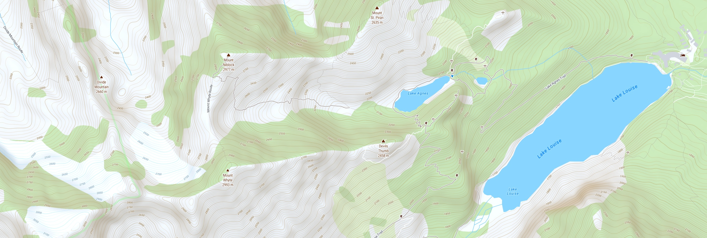
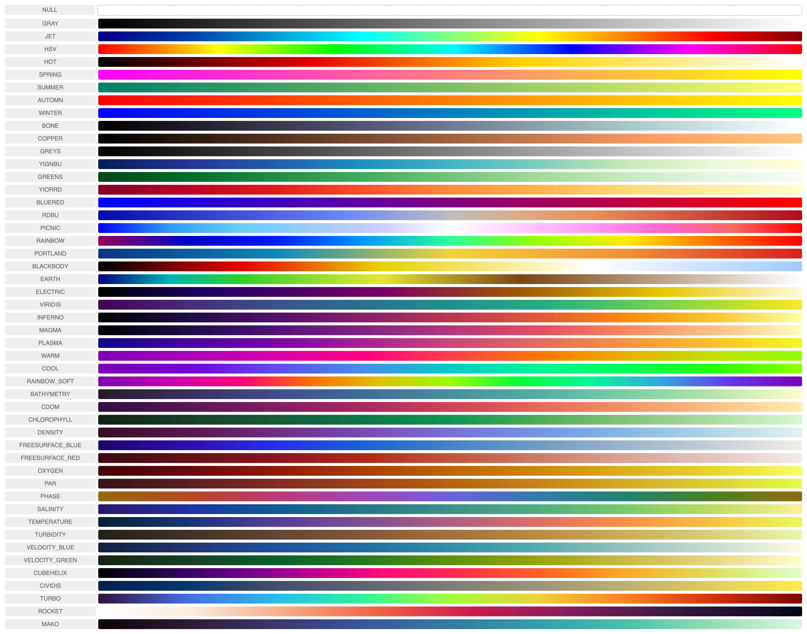
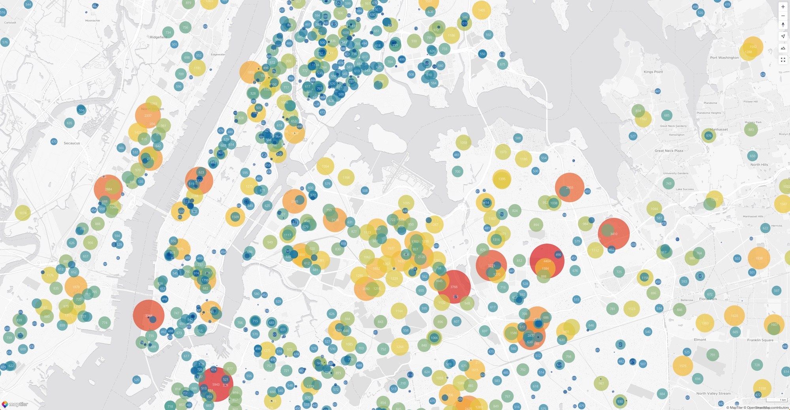
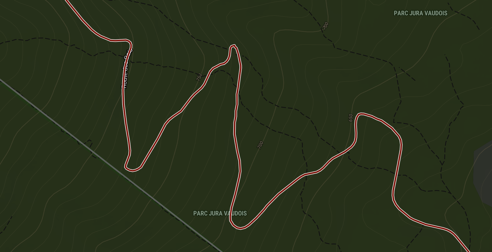
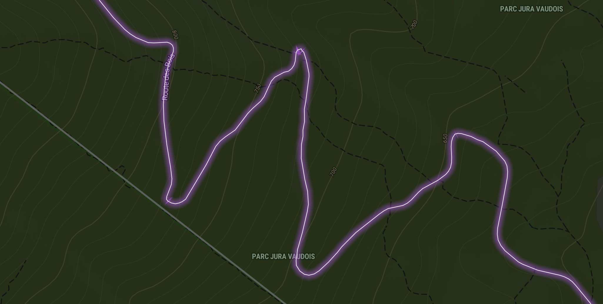
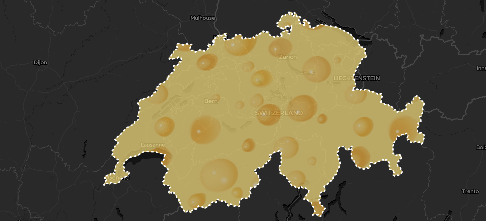
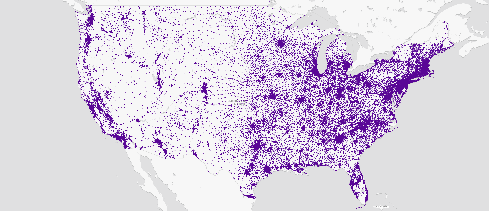
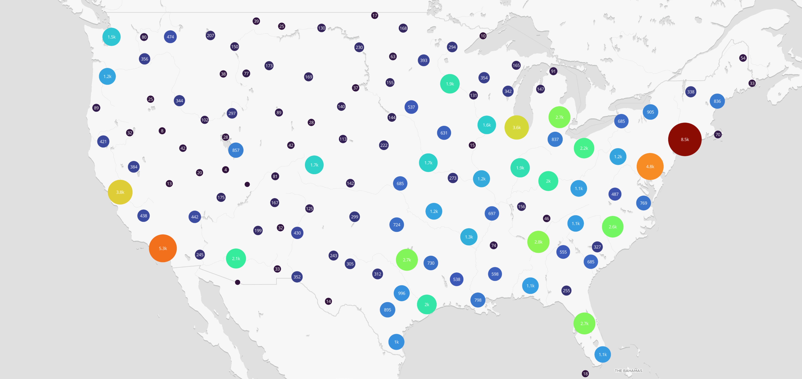

<p align="center">
  <a href="https://docs.maptiler.com/sdk-js/">official page →</a><br>
  
</p>

<p align="center" style="color: #AAA">
  The Javascript & TypeScript map SDK tailored for <a href="https://www.maptiler.com/cloud/">MapTiler Cloud</a>
</p>

<p align="center">
  
  
  </img>
  </img>
</p>

# What and why?
The **MapTiler SDK JS** extends MapLibre GL JS, exposes all its features, and adds new ones on top. The SDK is designed to work with the well-established  [MapTiler Cloud service](https://www.maptiler.com/cloud/), which provides all the data required to fuel a complete web mapping experience: vector tiles, satellite raster tiles, DEM with Terrain RGB, custom styles with an editor, etc.  

**Why are we creating a new SDK?** To make things simpler for developers working in the MapTiler ecosystem! With **MapTiler SDK JS**, there is no need to load external plugins for the most basic things, copy-paste complex data source URLs, or look up the syntax to enable 3D terrain every time you start a project. All this is built-in, loaded when needed, or exposed with simple functions. Under the hood, this SDK is opinionated as it's being fed by [MapTiler Cloud](https://www.maptiler.com/cloud/) data, but its MapLibre core makes it 100% compatible with other sources.  

In addition, the MapTiler SDK JS provides well-documented and easy-to-use wrapper functions to the [MapTiler Cloud API services](https://docs.maptiler.com/cloud/api) such as: geocoding, static maps, geolocation, as well as a search engine for coordinate reference systems and transforming coordinates from one CRS to another.
> 📣 *__Note:__* If you need <ins>only the API Client library</ins> to use in a headless fashion and without any map display, check out [MapTiler Client JS](https://github.com/maptiler/maptiler-client-js) library for browser and NodeJS.



# Install
```shell
npm install --save @maptiler/sdk
```

# API documentation
In addition to the details and examples provided in this readme, check out the [complete API documentation](https://docs.maptiler.com/sdk-js/api/)

# Quick start

## With ES modules
**Recommended for:** advanced applications

```ts
import * as maptilersdk from '@maptiler/sdk';

// Add your MapTiler Cloud API key to the config
// (Go to https://cloud.maptiler.com/account/keys/ to get one for free!)
maptilersdk.config.apiKey = 'YOUR_API_KEY';

// Let's say you have a DIV ready to receive a map
const mapContainer = document.getElementById('my-container-div');

// Instanciate the map
const map = new maptilersdk.Map({
  container: mapContainer,
});
```

Alternatively, the `apiKey` can be set as Map option instead of in the `config` object. Yet, this will still internally propagate to the `config` object:
```ts
import * as maptilersdk from '@maptiler/sdk';

// Let's say you have a DIV ready to receive a map
const mapContainer = document.getElementById('my-container-div');

// Instanciate the map
const map = new maptilersdk.Map({
  container: mapContainer,
  apiKey: 'YOUR_API_KEY';
});
```

By default, the map will be initialized with the style [streets-v2](https://www.maptiler.com/maps/#style=streets-v2).

Depending on the framework and environment you are using for your application, you will have to also include the CSS file. 

For example, with a [NextJS](https://nextjs.org/) app, this can take place at the top of the file `_app.ts/js`:
```ts
import "@maptiler/sdk/dist/maptiler-sdk.css";
```


## With CDN
The SDK hosted on our CDN is bundled as *[Universal Module Definition](https://github.com/umdjs/umd)* (UMD) to make it standalone and contain all its dependencies. The CDN also serves the style sheet (CSS).

**Recommended for:** simple map integration example and demos

```html
<html>
  <head>
    <title>MapTiler JS SDK example</title>
    <style>
      html, body {
        margin: 0;
      }

      #map-container {
        position: absolute;
        width: 100vw;
        height: 100vh;
      }
    </style>

    <!-- Load the SDK CSS -->
    <link rel="stylesheet" href="dist/maptiler-sdk.css">
  </head>

  <body>
    <div id="map-container"></div>
  
    <script src ="dist/maptiler-sdk.umd.js"></script>
    
    <script>
      // Add your MapTiler Cloud API key to the config
      // (Go to https://cloud.maptiler.com/account/keys/ to get one for free!)
      maptilersdk.config.apiKey = 'YOUR_API_KEY';

      const mapContainer = document.getElementById('my-container-div');

      const map = new maptilersdk.Map({
        container: mapContainer,
        style: maptilersdk.MapStyle.STREETS_DARK,
        hash: true,
      })
    </script>
  </body>
</html>
```

Check out the minimalist code samples in the [demos](demos) directory.


# Many styles to choose from
MapTiler teams maintain a few styles that we have decided to expose from the SDK. This has two advantages:
- they are easier to remember, no need to type along style URL
- if we make an update to a style, you will benefit from it without modifying your codebase

Here is how it works:
```ts
import { Map, MapStyle } from '@maptiler/sdk'

// When instanciating a map
const map = new Map({
  container: document.getElementById("my-container-div"),
  style: MapStyle.OUTDOOR, // <-- the shorthand for the outdoor style
});

// Or later on, updating the style
map.setStyle(MapStyle.STREETS.DARK);
```

The styles with a shorthand provided by the SDK are the following:

| ID | Screenshot | Comment |
|:-:|:-:|:-:|
|`MapStyle.STREETS`|[](https://www.maptiler.com/maps/#style=streets-v2&mode=2d&position=12.52/40.73676/-73.98418)|The classic default style, perfect for urban areas.<p>Also available in **dark** and **light** mode.</p>|
|`MapStyle.DATAVIZ.DARK`| [](https://www.maptiler.com/maps/#style=dataviz-dark&mode=2d&position=2.01/38.7/-27.0)|A minimalist style for data visualization.<p>Also available in **color** and **light** mode</p> |
|`MapStyle.SATELLITE`|[](https://www.maptiler.com/maps/#style=hybrid&mode=2d&position=7.87/24.518/-77.411)|Only high resolution satellite raster tiles without any labels|
|`MapStyle.HYBRID`|[](https://www.maptiler.com/maps/#style=hybrid&mode=2d&position=9.4/-26.175/122.6631)|Satellite tile with labels, landmarks, roads ways and political borders|
|`MapStyle.OUTDOOR`|[](https://www.maptiler.com/maps/#style=outdoor&mode=2d&position=11.96/46.02591/7.7273)|A solid hiking companion, with peaks, parks, isolines and more|
|`MapStyle.BASIC`|[](https://www.maptiler.com/maps/#style=basic-v2&mode=2d&position=13.09/37.78734/-122.42025)|A minimalist alternative to `STREETS`, with a touch of flat design.<p>Also available in **dark** and **light** and **pastel** mode.</p>|


<details>
  <summary>Know more about built-in map styles</summary>

MapTiler provides some **reference styles** as well as some **variants** for each. A **reference style** sets some guidelines about what kind of information is displayed, the granularity of the information, and more generally defines a purpose for which this style is the most relevant: street navigation, outdoor adventure, minimalist dashboard, etc. Then, each **reference style** offers a range of **variants** that contain the same level of information and have the same purpose but use different color schemes.

Here is the full list:
- `MapStyle.STREETS`, reference style for navigation and city exploration
  - `MapStyle.STREETS.DARK` (variant)
  - `MapStyle.STREETS.LIGHT` (variant)
  - `MapStyle.STREETS.PASTEL` (variant)
- `MapStyle.SATELLITE` reference style satellite and airborne imagery (no variants)
- `MapStyle.HYBRID` reference style satellite and airborne imagery with labels (no variants)
- `MapStyle.OUTDOOR` reference style for adventure
- `MapStyle.WINTER` reference style for winter adventure
- `MapStyle.DATAVIZ`, the perfect style for data visualization, with very little noise
  - `MapStyle.DATAVIZ.DARK` (variant)
  - `MapStyle.DATAVIZ.LIGHT` (variant)
- `MapStyle.BACKDROP`, great style for data visualization when hillshading matters!
  - `MapStyle.BACKDROP.DARK` (variant)
  - `MapStyle.BACKDROP.LIGHT` (variant)
- `MapStyle.BASIC` reference style for minimalist design and general purpose
  - `MapStyle.BASIC.DARK` (variant)
  - `MapStyle.BASIC.LIGHT` (variant)
- `MapStyle.BRIGHT` reference style for high-contrast navigation
  - `MapStyle.BRIGHT.DARK` (variant)
  - `MapStyle.BRIGHT.LIGHT` (variant)
  - `MapStyle.BRIGHT.PASTEL` (variant)
- `MapStyle.TOPO` reference style for topographic study
  - `MapStyle.TOPO.SHINY` (variant)
  - `MapStyle.TOPO.PASTEL` (variant)
  - `MapStyle.TOPO.TOPOGRAPHIQUE` (variant)
- `MapStyle.VOYAGER` reference style for stylish yet minimalist maps
  - `MapStyle.VOYAGER.DARK` (variant)
  - `MapStyle.VOYAGER.LIGHT` (variant)
  - `MapStyle.VOYAGER.VINTAGE` (variant)
- `MapStyle.TONER` reference style for very high contrast stylish maps 
  - `MapStyle.TONER.BACKGROUND` (variant)
  - `MapStyle.TONER.LITE` (variant)
  - `MapStyle.TONER.LINES` (variant)
- `MapStyle.OPENSTREETMAP` (reference style, this one does not have any variants)


All reference styles (instances of `ReferenceMapStyle`) and style variants (instances of `MapStyleVariant`) have methods to know the alternative styles and variants that belong to the same reference style (`.getVariants()`). This is handy to provide a default/dark/light alternative color scheme, yet preserving the same level of details as in the reference style. Read more about about [ReferenceMapStyle](https://docs.maptiler.com/sdk-js/api/map-styles/#referencemapstyle) and [MapStyleVariant](https://docs.maptiler.com/sdk-js/api/map-styles/#mapstylevariant).
</details>  

___


Still, you can still use some classic styles with just a *string* if you know their MapTiler Cloud ID:

```ts
map.setStyle('outdoor-v2');
```

And finally, you can use your own custom styles designed with [our style editor](https://cloud.maptiler.com/maps/). Every custom style is given a unique ID, for instance: `c912ffc8-2360-487a-973b-59d037fb15b8`.

This ID can be provided as such:
```ts
map.setStyle("c912ffc8-2360-487a-973b-59d037fb15b8");
```

Or in its extended form:
```ts
map.setStyle("https://api.maptiler.com/maps/c912ffc8-2360-487a-973b-59d037fb15b8/style.json");
// this could be suffixed with the API token as well
```

And can even be provided in the URI form:
```ts
map.setStyle("maptiler://c912ffc8-2360-487a-973b-59d037fb15b8");
```

# Centering the map on visitors
It is sometimes handy to center the map on the visitor's location, and there are multiple ways of doing it but for the SDK, we have decided to make this extra simple by using the [IP geolocation](#%EF%B8%8F%EF%B8%8F-geolocation) API provided by [MapTiler Cloud](https://docs.maptiler.com/cloud/api/geolocation/), directly exposed as a single option of the `Map` constructor. There are two strategies:
1. `POINT`: centering the map on the actual visitor location, optionally using the `zoom` option (zoom level `13` if none is provided). As a more precise option, if the user has previously granted access to the browser location (more precise) then this is going to be used.
2. `COUNTRY`: fitting the map view on the bounding box of the visitor's country. In this case, the `zoom` option, if provided, will be ignored

Here is how the map gets centered on the visitor's location:
```js
new maptilersdk.Map({
  // ... other options

  geolocate: maptilersdk.GeolocationType.POINT
})
```

Here is how the map fits the visitor's country bounds:
```js
new maptilersdk.Map({
  // ... other options

  geolocate: maptilersdk.GeolocationType.COUNTRY
})
```

The `geolocation` options will not be taken into consideration in the following cases:
- if the `center` option is provided, then it prevails
- if the `hash` option is provided with the value `true` **AND** a location hash is already part of the URL. If `hash` is `true` but there is not yet a location hash in the URL, then the geolocation will work.

> 📣 *__Note:__* if none of the options `center` or `hash` is provided to the `Map` constructor, then the map will be centered using the `POINT` strategy, unless the `geolocate` has the value `false`.

> 📣 *__Note 2:__* the term *IP geolocation* refers to finding the physical location of a computer using its *IP address*. The *IP address* is a numerical identifier of a computer within a network, just like the phone number for a telephone. The *IP geolocation* is **not** using the GPS of a device and usually provides a precision in the order of a few hundred meters. This precision may vary based on many local parameters such as the density of the network grid or the terrain, this is why it is generaly better not to use a zoom level higher than `14`.

# Easy to add controls
The term "control" is commonly used for all sorts of buttons and information displays that take place in one of the corners of the map area. The most well-known are probably the `[+]` and `[-]` zoom buttons as well as the attribution information. Plenty of others are possible and we have made a few easy to add and directly accessible from the `Map` constructor options:

- `navigationControl`
  - Shows the `[+]`, `[-]` and tilt/bearing/compass buttons
  - a boolean or a corner position. Showing on the top-right by default. Hidden if `false`.
- `geolocateControl`
  - Shows an arrow-shaped locate button. When clicked, it adds a marker and centers the map. If clicked again, the marker disappears (unless the map was moved since first clicked)
  - a boolean or a corner position. Showing on the top-right by default. Hidden if `false`.
- `terrainControl`
  - Shows a button to enable/disable the 3D terrain (does not tilt the map)
  - a boolean or a corner position. Hidden by default, showing on top-right if `true`.
- `scaleControl`
  - Shows a distance scale. The unit (`"metric"`, `"imperial"` or `"nautical"`) can be set in the config object `config.unit` (default: `"metric"`)
  - a boolean or a corner position. Hidden by default, showing on bottom-right if `true`.
- `fullscreenControl`
  - Shows a button that toggles the map into fullscreen
  - a boolean or a corner position. Hidden by default, showing on top-right if `true`.

The corner positions possible are:
- `"top-left"`
- `"top-right"`
- `"bottom-left"`
- `"bottom-right"`

**Example:**  
```ts
import { Map } from "@maptiler/sdk";

const map = new Map({
  container: document.getElementById("my-container-div"),
  terrainControl: false,
  scaleControl: true,
  fullscreenControl: "top-left",
})
```


# 3D terrain in one call
<p align="center">
  </img>
  </img>
</p>


Do you want to enable 3D terrain? That's easy now with a single function call:
```ts
// With the default exaggeration factor of 1
map.enableTerrain();

// Or, if you want to boost some volume a little
map.enableTerrain(1.5);
```

The terrain can also be enabled directly from the `Map` constructor, with the options `terrain` (a boolean, `false` by default) and `terrainExaggeration` (a number, `1` by default):

```ts
const map = new Map({
  // some options...
  terrain: true,
  terrainExaggeration: 1.5,
})
```

At any point, you can modify the exaggeration factor:
```ts
map.setTerrainExaggeration(2);
```

Or simply disable it:
```ts
map.disableTerrain()
```

> 📣 *__Note:__* Keep in mind that setting an exaggeration factor at `0` will result in a the same result as disabling the elevation but that terrain RGB tiles will still be fetched in the background.

> 📣 *__Note 2:__* please be aware that due to the volume and elevation of the map floor in 3D space, the navigation with the terrain enabled is slightly different than without.


# Easy language switching
The language generally depends on the style but we made it possible to easily set and update from a built-in list of languages.

The built-in list of supported languages is accessible from the `Language` object:
```ts
import { Language } from "@maptiler/sdk";
```
In the UMD bundle, it will be directly at `maptilersdk.Language`.

There are three distinct ways to set the language of a map:

1. **Global way, using the config object:**
```ts
import { config } from "@maptiler/sdk";

config.primaryLanguage = Language.ENGLISH;
```
Then, if any further language setting is applied, all the map instances created afterward will use this language. 

2. **Set the language at instantiation time:**
```ts
const map = new Map({
  // some options...
  language: Language.ENGLISH, // the ISO codes can also be used (eg. "en")
})
```
It will only apply `ENGLISH` as the language of this specific map instance (and will not alter the global `config`).

3. **Set the language after the map has been instantiated:**
```ts
map.setLanguage(Language.ENGLISH);
```
Again, it will only apply `ENGLISH` as the language of this specific map instance (and will not alter the global `config`).


The list of supported languages is built-in and can be found [here](src/language.ts). In addition, there are special language *flags*:
- `Language.AUTO` **[DEFAULT]** uses the language defined in the web browser
- `Language.STYLE_LOCK` to strictly use the language defined in the style. Prevents any further language update
- `Language.LOCAL` uses the language local to each country
- `Language.LATIN` uses a default with Latin characters
- `Language.NON_LATIN` uses a default with non-Latin characters

Whenever a label is not supported in the defined language, it falls back to `Language.LOCAL`.

Here is a sample of some compatible languages:


# Built-in support for right-to-left languages
Languages that are written right-to-left such as Arabic and Hebrew are fully supported by default. No need to install any plugins!

<p align="center">
  </img>
  </img>
</p>

# Custom Events and Map Lifecycle
## Events
### The `ready` event
The `ready` event happens just after the `load` event but waits until all the controls managed by the `Map` constructor are dealt with, some having an asynchronous logic to set up.  
Since the `ready` event waits until all the basic controls are nicely positioned, it is **safer** to use `ready` than `load` if you plan to add other custom controls with the `.addControl()` method.

This event works exactly the same way as `load` and you can safely replace those by `"ready"`. Here is a usage example:

```js
const map = new maptilersdk.Map({
  container: "map-container",
});

map.on("ready", (evt) => {
  const terrainControl = new maptilersdk.MaptilerTerrainControl();
  map.addControl(terrainControl);
})
```

### The `loadWithTerrain` event
The `loadWithTerrain` event is triggered only *once* in a `Map` instance lifecycle, when both the `ready` event and the `terrain` event **with non-null terrain** are fired. 

**Why a new event?**
When a map is instantiated with the option `terrain: true`, then MapTiler terrain is directly added to it and some animation functions such as `.flyTo()` or `.easeTo()` if started straight after the map initialization will actually need to wait a few milliseconds that the terrain is properly initialized before running.  
Relying on the `ready` or `load` event to run an animation with a map with terrain may fail in some cases for this reason, and this is why waiting for `loadWithTerrain` is safer in this particular situation.

## Lifecycle Methods
The events `load`, `ready` and `loadWithTerrain` are both called *at most once* and require a callback function to add more elements such as markers, layers, popups and data sources. Even though MapTiler SDK fully supports this logic, we have also included a *promise* logic to provide a more linear and less nested way to wait for a Map instance to be usable. Let's compare the two ways:

- Classic: with a callback on the `load` event:
```ts
function init() {

  const map = new Map({
    container,
    center: [2.34804, 48.85439], // Paris, France
    zoom: 14,
  });

  // We wait for the event.
  // Once triggered, the callback is ranin it's own scope.
  map.on("load", (evt) => {
    // Adding a data source
    map.addSource('my-gps-track-source', {
      type: "geojson",
      data: "https://example.com/some-gps-track.geojson",
    });
  })
}
```

- Modern: with a promise returned by the method `.onLoadAsync()`, used in an `async` function:
```ts
async function init() {

  const map = new Map({
    container,
    center: [2.34804, 48.85439], // Paris, France
    zoom: 14,
  });

  // We wait for the promise to resolve.
  // Once triggered, the rest of the init function runs
  await map.onLoadAsync();

  // Adding a data source
  map.addSource('my-gps-track-source', {
    type: "geojson",
    data: "https://example.com/some-gps-track.geojson",
  });
}
```

We deployed exactly the same logic for the `loadWithTerrain` event. Let's see how the two ways compare.
- Classic: with a callback on the `loadWithTerrain` event:
```ts
function init() {

  const map = new Map({
    container,
    center: [2.34804, 48.85439], // Paris, France
    zoom: 14,
    terrain: true,
  });

  // We wait for the event.
  // Once triggered, the callback is ran in its own scope.
  map.on("loadWithTerrain", (evt) => {
    // make an animation
    map.flyTo({
      center: [-0.09956, 51.50509], // London, UK
      zoom: 12.5,
    })
  })
}
```

- Modern: with a promise returned by the method `.onLoadWithTerrainAsync()`, used in an `async` function:
```ts
async function init() {

  const map = new Map({
    container,
    center: [2.34804, 48.85439], // Paris, France
    zoom: 14,
    terrain: true,
  });

  // We wait for the promise to resolve.
  // Once triggered, the rest of the init function runs
  await map.onLoadWithTerrainAsync();

  // make an animation
  map.flyTo({
    center: [-0.09956, 51.50509], // London, UK
    zoom: 12.5,
  })
}
```

And finally, the lifecycle method corresponding to the `ready` event:
- Classic: with a callback on the `ready` event:
```ts
function init() {

  const map = new Map({
    container,
    center: [2.34804, 48.85439], // Paris, France
    zoom: 14,
  });

  // We wait for the event.
  // Once triggered, the callback is ranin it's own scope.
  map.on("ready", (evt) => {
    // Adding a data source
    map.addSource('my-gps-track-source', {
      type: "geojson",
      data: "https://example.com/some-gps-track.geojson",
    });
  })
}
```

- Modern: with a promise returned by the method `.onReadyAsync()`, used in an `async` function:
```ts
async function init() {

  const map = new Map({
    container,
    center: [2.34804, 48.85439], // Paris, France
    zoom: 14,
  });

  // We wait for the promise to resolve.
  // Once triggered, the rest of the init function runs
  await map.onReadyAsync();

  // Adding a data source
  map.addSource('my-gps-track-source', {
    type: "geojson",
    data: "https://example.com/some-gps-track.geojson",
  });
}
```

We believe that the *promise* approach is better because it does not nest scopes and will allow for a linear non-nested stream of execution. It also corresponds to more modern development standards.

> 📣 *__Note:__* Generally speaking, *promises* are not a go to replacement for all event+callback and are suitable only for events that are called only once in the lifecycle of a Map instance. This is the reason why we have decided to provide a *promise* equivalent only for the `load`, `ready` and `loadWithTerrain` events but not for events that may be called multiple time such as interaction events.

# Color Ramps
A color ramp is a color gradient defined in a specific interval, for instance in [0, 1], and for any value within this interval will retrieve a color. They are defined by at least a color at each bound and usually additional colors within the range.  

Color ramps are super useful to represent numerical data in a visual way: the temperature, the population density, the average commute time, etc.  

The SDK includes many built-in ready-to-use color ramps as well as extra logic to manipulate them and create new ones, here is the full list:



To use an already existing color ramp and access some of its values:
```ts
import { ColorRampCollection } from "@maptiler/sdk";

// The TURBO color ramp, just like all the built-ins, is defined in [0, 1],
// but we can rescale it to fit the range of temperature [-18, 38]°C (equivalent to [0, 100]F)
// and this actually creates a clone of the original TURBO
const temperatureTurbo = ColorRampCollection.TURBO.scale(-18, 38);

// What's the color at 0°C (or 32F) ?
const zeroColor = temperatureTurbo.getColor(0);
// The color is an array: [45, 218, 189, 255]

// Alternatively, we can ask for the hex color:
const zeroColorHex = temperatureTurbo.getColorHex(0);
// The color is a string: "#2ddabdff"
```

Creating a new one consists of defining all the colors for each *color stops*. The values can be in the range of interest and *do not* have to be in [0, 1]. For example, let's recreate a *Viridis* color ramp but with a range going from 0 to 100:

```ts
import { ColorRamp } from "@maptiler/sdk";

const myCustomRamp = new ColorRamp({
  stops: [
    { value: 0, color: [68, 1, 84] },
    { value: 13, color: [71, 44, 122] },
    { value: 25, color: [59, 81, 139] },
    { value: 38, color: [44, 113, 142] },
    { value: 5, color: [33, 144, 141] },
    { value: 63, color: [39, 173, 129] },
    { value: 75, color: [92, 200, 99] },
    { value: 88, color: [170, 220, 50] },
    { value: 100, color: [253, 231, 37] },
  ]
});
```

When defining a new *ramp*, the colors can be an RGB array (`[number, number, number]`) or an RGBA array (`[number, number, number, number]`).

Many methods are available on color ramps, such as getting the `<canvas>` element of it, rescaling it, flipping it or [resampling it in a non-linear way](colorramp.md). Read more on [our reference page](https://docs.maptiler.com/sdk-js/api/color-ramp/) and have a look at our [examples](https://docs.maptiler.com/sdk-js/examples/?q=colorramp) to see how they work.


# Vector Layer Helpers
**Let's make vector layers easy!** Originally, you'd have to add a source and then proceed to the styling of your layer, which can be tricky because there are a lot of `paint` and `layout` options and they vary a lot from one type of layer to another. **But we have helpers for this!** 🖋️


## Shared logic
Helpers come with a lot of **built-in defaults** and some fail-proof logic that makes creating vector layers much easier! As a result, a dataset can be displayed in one call, creating both the datasource and the layer(s) in one go!

Depending on the type of feature to add (point, polyline, polygon or heatmap), a different helper function needs to be used, but datasource could contain mixed types of feature and the helper will only display a specific type.

All the helpers are made available under the `helpers` object. If you are using ES Modules, this is how you access them:
```ts
import { Map, helpers } from "@maptiler/sdk";
```

If you are using the UMD bundle of the SDK, for example from our CDN, you will find the `helpers` with:
```js
maptilersdk.helpers
```

**Example:** we have a *geoJSON* file that contains both *polygons* and *point* and we use it as the `data` property on the `helpers.addPoint(map, { options })`, this will only add the *points*.

In addition to easy styling, the helper's datasource can be:
- a URL to a geoJSON file or its string content
- a URL to a GPX or KML file (only for the polyline helper) or its string content
- a UUID of a MapTiler Cloud dataset

### Multiple Layers
The key design principle of these vector layer helpers is **it's easy to make what you want**, which is very different from **making MapLibre easier to use**.  

> For example, to create a road with an outline, one must draw two layers: a wider base layer and a narrower top layer, fueled by the same polyline data. This requires ordering the layers properly and computing not the width of the outline, but rather the width of the polyline underneath so that it outgrows the top road layer of the desired number of pixels. 

With the polyline helper, you just say if you want an outline and specify its size (or even a zoom-dependent size) and everything is handled for you. As a result, calling the method `helpers.addPolyline` will return an object with **multiple IDs**: the ID of the top/main layer, the ID of the outline layer (could be `null`) and the ID of the data source. This makes further layer and source manipulation possible.

### Input

The vector layer helper also shares some *I/O* logic: each of them can take many options but a subset of them is common across all the helpers:

```ts
/**
 * A geojson Feature collection or a URL to a geojson or the UUID of a MapTiler Cloud dataset.
 */
data: FeatureCollection | string;

/**
 * ID to give to the layer.
 * If not provided, an auto-generated ID of the for "maptiler-layer-xxxxxx" will be auto-generated,
 * with "xxxxxx" being a random string.
 */
layerId?: string;

/**
 * ID to give to the geojson source.
 * If not provided, an auto-generated ID of the for "maptiler-source-xxxxxx" will be auto-generated,
 * with "xxxxxx" being a random string.
 */
sourceId?: string;

/**
 * The ID of an existing layer to insert the new layer before, resulting in the new layer appearing
 * visually beneath the existing layer. If this argument is not specified, the layer will be appended
 * to the end of the layers array and appear visually above all other layers.
 */
beforeId?: string;

/**
 * Zoom level at which it starts to show.
 * Default: `0`
 */
minzoom?: number;

/**
 * Zoom level after which it no longer show.
 * Default: `22`
 */
maxzoom?: number;
```


## Polyline Layer Helper
The method `helpers.addPolyline` is not only compatible with the traditional GeoJSON source but also with **GPX** and **KML** files and the `.data` options can be a MapTiler Cloud dataset UUID and will be resolved automatically.

here is the minimal usage, with the default line width and a random color (within a selected list):
```ts
helpers.addPolyline(map, { 
  // A URL, relative or absolute
  data: "some-trace.geojson",
});
```


We can add many options, such as specific color, a custom width or a dash pattern, this time sourcing the data from MapTiler Cloud, using the UUID of a dataset:
```ts
helpers.addPolyline(map, { 
  data: "74003ba7-215a-4b7e-8e26-5bbe3aa70b05",
  lineColor: "#FF6666",
  lineWidth: 4,
  lineDashArray: "____ _ ",
  lineCap: "butt",
});
```

As you can see, we've come up with a fun and easy way to create **dash arrays**, just use *underscores* and *white spaces* and this pattern will repeat!

Adding an outline is also pretty straightforward:
```ts
helpers.addPolyline(map, { 
  data: "74003ba7-215a-4b7e-8e26-5bbe3aa70b05",
  lineColor: "#880000",
  outline: true,
});
```


Endless possibilities, what about a glowing wire?
```ts
helpers.addPolyline(map, { 
  data: "74003ba7-215a-4b7e-8e26-5bbe3aa70b05",
  lineColor: "#fff",
  lineWidth: 1,
  outline: true,
  outlineColor: "#ca57ff",
  outlineWidth: 2,
  outlineWidth: 10,
  outlineBlur: 10,
  outlineOpacity: 0.5,
});
```



All the other options are documented on [our reference page](https://docs.maptiler.com/sdk-js/api/helpers/#polyline) and more examples are available [here](https://docs.maptiler.com/sdk-js/examples/?q=polyline+helper).

## Polygon Layer Helper
The polygon helper makes it easy to create vector layers that contain polygons, whether they are *multi*polylons, *holed*polygons or just simple polygons. Whenever it's possible and it makes sense, we use the same terminology across the different helpers.

Here is a minimalist example, with a half-transparent polygon of Switzerland, from a local file:

```ts
helpers.addPolygon(map, {
  data: "switzerland.geojson",
  fillOpacity: 0.5,
});
```

Again, if no color is specified, a random one from a list is being picked:


Plenty of options are available to create interesting thematic visualizations:

```ts
helpers.addPolygon(map, {
  data: "switzerland.geojson",
  pattern: "cheese512.png",
  outline: true,
  outlineWidth: 3,
  outlineColor: "white",
  outlineDashArray: "_ ",
  fillOpacity: 0.7,
});
```


All the other options are documented on [our reference page](https://docs.maptiler.com/sdk-js/api/helpers/#polygon) and more examples are available [here](https://docs.maptiler.com/sdk-js/examples/?q=polygon+helper).

## Point Layer Helper
A point visualization may appear like the simplest of all, but we noticed this is where people get the most creative: cluster, data-driven variable radius, but also scaled with zoom, with or without labels, data-driven colors, etc. Our helper supports all of these and will fill-in with built-in default for what's missing.

Here is the simplest example, with a dataset loaded from a local file:
```ts
helpers.addPoint(map, {
  data: "public-schools.geojson",
})
```
if no color is specified, a random color is used and the default radius is ramped over the zoom level:


Here is the same dataset, but with *point clustering* enabled:
```ts
helpers.addPoint(map, {
  data: "public-schools.geojson",
  cluster: true,
});
```
On the other hand, if clusters are enabled, the default color is fueled by the color ramp `TURBO` scaled from `10` to `10000` non-linearly resampled with the method `"ease-out-square"`. The size also varies from `minPointradius` (default: `10`) to `maxPointRadius` (default: `50`):


With the point helper, it's also possible to adapt the color and the radius based on a property. In the following example, we display a point for each public school, with the scaling factor being the number of students:
```ts
helpers.addPoint(map, {
  data: "public-schools.geojson",
  property: "students",
  pointColor: ColorRampCollection.PORTLAND.scale(200, 2000).resample("ease-out-sqrt"),
  pointOpacity: 0.8,
  minPointRadius: 6,
  maxPointRadius: 30,
  showLabel: true,
  zoomCompensation: false,
})
```


Here, the`PORTLAND` color ramp is going to be used so that schools with `200` students or less will have the colors at the very beginning of the color ramp and schools with `2000` or more will have the color defined at the very end. Schools in between will be attributed a color in a non-linear fashion, following the `"ease-out-sqrt"` method (read **Color Ramps** section above for more info).

All the other options are documented on [our reference page](https://docs.maptiler.com/sdk-js/api/helpers/#point) and more examples are available [here](https://docs.maptiler.com/sdk-js/examples/?q=point+helper).

## Heatmap Layer Helper
The heatmap layer is a great alternative for visualizing a collection of sparse data, but it can be challenging to use, especially when one has to come up with their own color ramp from scratch. **The helper makes this much easier!**

Here is a minimalist example, using the default built-in `TURBO` color ramp:
```ts
helpers.addHeatmap(map, {
  data: "public-schools.geojson",
});
```


Some visualizations are created with a fixed geographic extent or zoom level in mind, whether it's a survey at the scale of a single neighborhood or statistics at a country scale. In this case, we want to tailor the color, radius, weight and intensity of the heatmap blobs exactly for these precise settings. In the following example, we disable the *zoom compensation* to make sure radio and intensity are never zoom-dependant:
```ts
helpers.addHeatmap(map, {
  data: "public-schools.geojson",
  property: "students",
  // radius: how wide are the blobs
  radius: [
    {propertyValue: 100, value: 15},
    {propertyValue: 800, value: 50},
  ],
  // weight: how intense are the blob, as fueled by a property
  weight: [
    {propertyValue: 100, value: 0.1},
    {propertyValue: 800, value: 1},
  ],
  // A custom color ramp, must be used with its default interval of [0, 1]
  colorRamp: ColorRampCollection.MAGMA,
  zoomCompensation: false,
  opacity: 0.6,
  // a global factor applied to all the blobs, regardless of the property or zoom
  intensity: 1.2,
});
```

Turning off *zoom compensation* allows for more accurate adjustments to the visualization at a specific zoom level, but it may not adapt as smoothly when zooming in or out.

All the other options are documented on [our reference page](https://docs.maptiler.com/sdk-js/api/helpers/#heatmap) and more examples are available [here](https://docs.maptiler.com/sdk-js/examples/?q=heatmap+helper).

# Other helper
## Take Screenshots, programmatically
There are two different ways to create screenshot, corresponding to two very different usecases. Note that screenshots will not contain *DOM elements* such as `Marker` and `Popup`, since those are not part of the rendering context.

**1. Get a `blob` of a screenshot, PNG encoded:**
```ts
import { Map, helpers } from "@maptiler/sdk";

// ... initialize a Map instance, wait for the "load" or "ready" event ...

// Inside an async function, or with using .then()
const blob = await helpers.takeScreenshot(map);
```
The returned `Blob` of a PNG image file can be very handy if the goal is to programmatically further manipulate the screenshot, such as sending it to some feedback endpoint with a POST request.

**2. Download a PNG file:**
```ts
import { Map, helpers } from "@maptiler/sdk";

// ... initialize a Map instance, wait for the "load" or "ready" event ...

// No need to be inside an async function, the download will be triggered when the file is ready
maptilersdk.helpers.takeScreenshot(map, {
  download: true, 
  filename: "map_screenshot.png"
});
```
Getting a file directly is a nice option that can be useful to share some debugging context with colleagues, compare multiple styles, or share your creation on social media.

> 📣 *__Note:__* Keep in mind that MapTiler Cloud data are copyrighted and their usage is restricted. This include MapTiler built-in styles and tilesets, among others. In case of doubt, do not hesitate to read our [terms](https://www.maptiler.com/terms/) or to ask our [support team](https://www.maptiler.com/contacts/).

# Caching
Starting from v2, MapTiler SDK introduced the **caching** of tiles and fonts served by MapTiler Cloud, which can represent a large chunk of the data being fetched when browsing a map. This caching leverages modern browsers caching API so it's well-managed and there is no risk of bloating! When we update **MapTiler Planet** or our **official styles**, the caching logic will detect it and automatically invalidate older versions of the tiles that were previously cached.

Caching greatly improves the performance at load time and positively impacts the user experience, for this reason, it is **enabled by default**. If for debugging purposes or for a very specific use-case caching needs to be disabled, then it is possible:

```ts
import { config } from "@maptiler/sdk";

config.caching = false;
```

# Easy access to MapTiler Cloud API
Our map SDK is not only about maps! We also provide plenty of wrappers to our API calls!

> 📣 *__Note:__* If you need <ins>only the API Client library</ins> to use in a headless fashion and without any map display, check out out [API Client library](https://docs.maptiler.com/client-js/) for browser and NodeJS. It's exactely what is down below and only that, in a minimalistic [TypeScript package](https://github.com/maptiler/maptiler-client-js) 🐙.


## 🔍 Geocoding
> ✅ Please, use geocoding functions only from client-side (browser) and do not 🚫 **store** or **redistribute** MapTiler Cloud API data. In case of doubt, consult the [terms](https://www.maptiler.com/cloud/terms/#explicitly-prohibited-use) ⚖️

### Forward
You want to know the longitude and latitude of a specific place, use the forward geocoding:
```ts
// in an async function, or as a 'thenable':
const result = await maptilersdk.geocoding.forward('paris');
```
You can provide some options such as:
- the proximity, given a lon-lat position, to sort the results
- one of more languages to get the results into
- a bounding geo box, to restrict the search to a given window

Read more about forward geocoding on our [official documentation](https://docs.maptiler.com/client-js/geocoding/#forward).

### Reverse
You want to know the name of a place, given a longitude-latitude? Use the reverse geocoding:
```ts
// in an async function, or as a 'thenable':
const result = await maptilersdk.geocoding.reverse([6.249638, 46.402056]);
```
The same option object as the forward geocoding can be provided.

Read more about reverse geocoding on our [official documentation](https://docs.maptiler.com/client-js/geocoding/#reverse).

### Language
For both *forward* and *reverse* geocoding, this library provides a list of supported languages as shorthands to [ISO language codes](https://en.wikipedia.org/wiki/ISO_639-1). The result will be provided in multiple languages if the `language` option is an array:

```ts
const result = await maptilersdk.geocoding.forward('paris', {language: [maptilersdk.geocoding.languages.SPANISH, maptilersdk.geocoding.languages.KOREAN]})
```

The special language `AUTO` will detect the platform/browser preferred language.

## 🕵️‍♂️ Geolocation
The geolocation service provides location information of a visitor using its IP address.

The geolocation uses the IP address of a visitor to provide information about their location, such as city, region, country, timezone, etc. The precision is lower than GPS but does not require visitors to explicitly enable the location service from their web browser.

There is only a single function:
```ts
// in an async function, or as a 'thenable':
const result = await maptilersdk.geolocation.info();
```

Read more about geolocation on our [official documentation](https://docs.maptiler.com/client-js/geolocation/).

## 🌐 Coordinates
If you are already familiar with [epsg.io](https://epsg.io/) (created by MapTiler), then you may find it convenient to access the details of more than 10 thousands coordinate reference systems (CRS) programmatically, as well as transform coordinates from one system to another!

### Search
The `search` lets you perform a query in a free-form fashion. Here are some examples:
```ts
// in an async function, or as a 'thenable':
const resultA = await maptilersdk.coordinates.search('mercator');
const resultB = await maptilersdk.coordinates.search('plate carree');
const resultC = await maptilersdk.coordinates.search('france');
const resultD = await maptilersdk.coordinates.search('code:4326', {transformations: true}));
```

The `transformations` options retrieve a lot more details about the CRS that MapTiler API is able to transform to/from than just their IDs.

Read more about searching coordinate systems on our [official documentation](https://docs.maptiler.com/client-js/coordinates/#search).

### Transform
Transforming a couple of coordinates from one system to another can be challenging, for example, most countries have their own official system, yet web mapping tools are more often than not exclusive to [WGS84](https://epsg.io/4326).

If not provided, both the source (`sourceCrs`) and the destination (`targetCrs) are defaulted to **EPSG:4326**** (in other words, [WGS84](https://epsg.io/4326)). Here is how to use this feature:

```ts
// in an async function, or as a 'thenable':

// Providing one coordinate to transform, with a target CRS being EPSG:9793 (RGF93 v2 / Lambert-93, France official CRS)
const resultA = await maptilersdk.coordinates.transform([1, 45], {targetCrs: 9793})

// Using the same logic, we can pass up to 50 coordinates to be transformed
const resultB = await maptilersdk.coordinates.transform([[10, 48], [1, 45]], {targetCrs: 9793})
```

Read more about transforming coordinates on our [official documentation](https://docs.maptiler.com/client-js/coordinates/#transform).

## 💽 Data
MapTiler Cloud gives its users the possibility to [upload and create data](https://cloud.maptiler.com/data/), manually with a user interface or by uploading a GPX, GeoJSON, KML or shp file. A unique ID is associated with each dataset so that we can later access it programmatically to retrieve a GeoJSON equivalent of it:

```ts
// in an async function, or as a 'thenable':
const result = await maptilersdk.data.get('my-dataset-unique-id')
```

Since the result is a GeoJSON, it can easily be added to a `map` with `.addSource()` and `.addLayer()`.

Read more about fetching your own data on our [official documentation](https://docs.maptiler.com/client-js/data/).

## 🗺️ Static maps
> ✅ Please, use static maps URLs only from client side `` elements, and do not 🚫 store or redistribute the static map files. In case of doubt, consult the [terms](https://www.maptiler.com/cloud/terms/#explicitly-prohibited-use) ⚖️

Maptiler Cloud provides many possibilities for creating static maps as PNG, JPEG or WebP images. They all offer the possibilities to:
- Choose from one of the MapTiler styles or your own
- Add markers with a custom icon (or default icon with a custom color)
- Add a path or polygon, with a parametric line width and color and a parametric filling color

Three modes are available: `centered`, `bounded` and `automatic`.

> 📣 *__important:__* <span style="text-decoration: underline">only image **URLs** are returned.</span>   
> Contrary to the other functions of this library, the static map functions **do not** perform any query to MapTiler Cloud API, instead they build the image URL for you to use in `` elements.


### Map Styles
In the following static map functions, the `option` object features a `style` property that can be a string or one of the built-in style shorthand. Here is the full list:

- `MapStyle.STREETS`, reference style for navigation and city exploration
  - `MapStyle.STREETS.DARK` (variant)
  - `MapStyle.STREETS.LIGHT` (variant)
  - `MapStyle.STREETS.NIGHT` (variant)
  - `MapStyle.STREETS.PASTEL` (variant)
- `MapStyle.OUTDOOR` reference style for adventure
  - `MapStyle.OUTDOOR.DARK` (variant)
- `MapStyle.WINTER` reference style for winter adventure
  - `MapStyle.WINTER.DARK` (variant)
- `MapStyle.SATELLITE` reference style satellite and airborne imagery (no variants)
- `MapStyle.HYBRID` reference style satellite and airborne imagery with labels (no variants)
- `MapStyle.BASIC` reference style for minimalist design and general purpose
  - `MapStyle.BASIC.DARK` (variant)
  - `MapStyle.BASIC.LIGHT` (variant)
- `MapStyle.BRIGHT` reference style for high-contrast navigation
  - `MapStyle.BRIGHT.DARK` (variant)
  - `MapStyle.BRIGHT.LIGHT` (variant)
  - `MapStyle.BRIGHT.PASTEL` (variant)
- `MapStyle.TOPO` reference style for topographic study
  - `MapStyle.TOPO.SHINY` (variant)
  - `MapStyle.TOPO.PASTEL` (variant)
  - `MapStyle.TOPO.TOPOGRAPHIQUE` (variant)
- `MapStyle.VOYAGER` reference style for stylish yet minimalist maps
  - `MapStyle.VOYAGER.DARK` (variant)
  - `MapStyle.VOYAGER.LIGHT` (variant)
  - `MapStyle.VOYAGER.VINTAGE` (variant)
- `MapStyle.TONER` reference style for very high contrast stylish maps 
  - `MapStyle.TONER.BACKGROUND` (variant)
  - `MapStyle.TONER.LITE` (variant)
  - `MapStyle.TONER.LINES` (variant)
- `MapStyle.OPENSTREETMAP` (reference style, this one does not have any variants)
- `MapStyle.STAGE`, the perfect style for data visualization, with very little noise
  - `MapStyle.STAGE.DARK` (variant)
  - `MapStyle.STAGE.LIGHT` (variant)

### Centered static maps
This type of map is centered on a longitude-latitude coordinate and the zoom level must also be provided (from `0`: very zoomed out, to `22`: very zoomed in).  
Note that if a path or markers are provided, the framing of the map will not automatically adapt to include those (use the `automatic` mode for that).

```ts
const imageLink = maptilersdk.staticMaps.centered(
  // center position (Boston)
  [-71.06080, 42.362114], 

  // zoom level
  12.5, 
  
  // Options
  {
    // Request a hiDPI/Retina image
    hiDPI: true,

    // Output image size
    width: 1000,
    height: 1000,

    // Map style
    style: maptilersdk.MapStyle.OUTDOOR,
  });
```

Read more about centered static maps on our official [API documentation](https://docs.maptiler.com/cloud/api/static-maps/#center-based-image).


### Bounded static maps
This type of map requires a bounding box made of two points: the south-west bound and the north-east bound. The zoom level cannot be provided and is automatically deduced from the size of the bounding box.

```ts
const imageLink = maptilersdk.staticMaps.bounded(
  // The bounding box on Europe
  [
    -24,  // west bound (min x)
    34.5, // south bound (min y)
    32,   // east bound (max x)
    71,   // north bound (max y)
  ],

  // Options
  {
    hiDPI: true,
    width: 2048,
    height: 2048,
    style: maptilersdk.MapStyle.STREETS.DARK,

    // Extra space that will add around the bounding box, in percentage
    // (0.1 = 10% is actually the dafault)
    padding: 0.1
  });
```

Since the zoom level cannot be provided, the level of details is dictated by the size of the output image. here is an example:

| `2048 x 2048`      | `1024 x 1024` |
| :-----------: | :-----------: |
|       |        |

As you may notice, the geo bounding box could have very different proportions than the output image size. In the following example, we place the very same bounding box around Portugal, which has a this particular strip looking shape. We also add a `path` that repeats exactly the same bounding box to show the difference between the provided bounding box and the final image. We kept the default padding of 10%:


| `2048 x 2048`      | `1024 x 2048` |
| :-----------: | :-----------: |
|       |        |


Read more about bounded static maps on our official [API documentation](https://docs.maptiler.com/cloud/api/static-maps/#bounds-based-image).

### Automatic static maps
As we have seen with centered and bounded maps, providing all the parameters is nice but can be cumbersome for the simplest use cases. This is why MapTiler Cloud also provides static maps that fit automatically whatever you need to place inside: path or markers.

In the following example, we are going to load a cycling track recorded by one of our team members in Montreal, Canada. The track, originally a GPX file, was pushed to MapTiler Data and is now made available as a GeoJSON:

```ts
// Fetching the GeoJSON
const bikeTrack = await maptilersdk.data.get('the-id-of-a-bike-track-in-montreal');

// Extracting the track points with the shape [[lng, lat], [lng, lat], ...]
const trackPoints = bikeTrack.features[0].geometry.coordinates[0]
  .map(p => p.slice(0, 2));

const imageLink = maptilersdk.staticMaps.automatic({
  // hiDPI/Retina precision
  hiDPI: true,

  // A fairly large output image
  width: 2048,
  height: 1024 ,

  // A grey style on which the track will pop!
  style: maptilersdk.MapStyle.STREETS.LIGHT,

  // Draw a path with the trackpoints
  path: trackPoints,

  // Adding a marker for the starting point, with a custom color (array of shape [lng, lat, color])
  markers: [trackPoints[0][0], trackPoints[0][1], '#0a0'],

  // Showing the track in red
  pathStrokeColor: 'red',
});
```

And voila!


> 📣 *__Note:__* The GeoJSON for this track contains 9380 couples of coordinates, which is a lot! In order to send the track to MapTiler Cloud static maps API, the client simplifies the long paths while keeping a high degree of precision using a very fast [Ramer-Douglas-Peucker algorithm](https://en.wikipedia.org/wiki/Ramer%E2%80%93Douglas%E2%80%93Peucker_algorithm).

Read more about bounded static maps on our official [API documentation](https://docs.maptiler.com/cloud/api/static-maps/#auto-fitted-image).

## 🏔️ Elevation
With the elevation API, it's possible to get the elevation in meters from any location. It's possible to lookup and compute elevation for a single location, to provide a batch of points, from a GeoJSON LineString or a GeoJSON MultiLineString!

> ℹ️ Under the hood, the elevation API is fueled by MapTiler Cloud's **RGB Terrain** raster tileset, which is a composite of many high-resolution DEMs from all over the world, currated and processed by our geodata team! The same dataset is also fueling our SDK's elevation (3D terrain) and the hillshading we use in many of our styles.

> 📣 Note for **TypeScript** users: internaly, the elevation feature relies on some *GeoJSON* types definitions that can be found in this NPM package: `@types/geojson`. Namely `LineString`, `MultiLineString` and `Position`. It may improve your developer experience to also use these types. 

Let's see how to use it:

### At a single location
```ts
// Not mandatory, but it's to explain where the type comes from:
import { Position } from "geojson";

const montBlancPeak: Position = [6.864884, 45.832743];
const elevatedPosition = await maptilersdk.elevation.at(montBlancPeak);
```
The returned value is also a *GeoJSON* `Position` array, but with three elements: `[lng, lat, elevation]`.

Read more about elevation lookup for a single location in our [official documentation](https://docs.maptiler.com/client-js/elevation/#at).

### Batch mode
```ts
// Not mandatory, but it's to explain where the type comes from:
import { Position } from "geojson";

const peaks: Position[] = [
  [6.864884, 45.832743],   // Mont Blanc, Alps
  [86.9250, 27.9881],      // Mount Everest, Himalayas
  [-70.0109, -32.6532],    // Aconcagua, Andes
  [-151.0064, 63.0695],    // Denali, Alaska
  [37.3556, -3.0674],      // Mount Kilimanjaro
  [42.4453, 43.3499],      // Mount Elbrus, Caucasus
  [137.1595, -4.0784],     // Puncak Jaya, Sudirman Range
  [-140.4055, 60.5672],    // Mount Logan, Saint Elias Mountains
  [138.73111, 35.358055],  // Mount Fuji
];

const elevatedPeaks = await maptilersdk.elevation.batch(peaks);
```

Read more about elevation lookup for a batch of locations in our [official documentation](https://docs.maptiler.com/client-js/elevation/#batch).

### From a GeoJSON LineString
In the *GeoJSON* LineString case, it clones the entire structure and the position arrays of the clone will contain three elements: `[lng, lat, elevation]`. The original LineString is not mutated nor pointed at.

```ts
// Not mandatory, but it's to explain where the type comes from:
import { LineString } from "geojson";


const someLineString: LineString = {
  type: "LineString",
  coordinates: [[6.864884, 45.832743], [86.9250, 27.9881], [-70.0109, -32.6532]]
};

const someElevatedLineString = await maptilersdk.elevation.fromLineString(someLineString);
// someElevatedLineString is also of type LineString
```

Read more about elevation lookup for a `LineString` in our [official documentation](https://docs.maptiler.com/client-js/elevation/#linestring).

### From a GeoJSON MultiLineString
In the *GeoJSON* MultiLineString case, it clones the entire structure and the position arrays of the clone will contain three elements: `[lng, lat, elevation]`. The original MultiLineString is not mutated nor pointed at.

```ts
// Not mandatory, but it's to explain where the type comes from:
import { MultiLineString } from "geojson";


const someMultiLineString: MultiLineString = {
  type: "LineString",
  coordinates: [
    [[6.864884, 45.832743], [86.9250, 27.9881], [-70.0109, -32.6532]],
    [[-151.0064, 63.0695], [37.3556, -3.0674], [42.4453, 43.3499]],
    [[137.1595, -4.0784], [-140.4055, 60.5672], [138.73111, 35.358055]],
  ]
};

const someElevatedMultiLineString = await maptilersdk.elevation.fromMultiLineString(someMultiLineString);
// someElevatedMultiLineString is also of type MultiLineString
```

Read more about elevation lookup for a `MultiLineString` in our [official documentation](https://docs.maptiler.com/client-js/elevation/#multilinestring).

### Caching
In order to increase performance while reducing unnecessary elevation data fetching, the elevation tiles are cached. This is particularly important for the LineString and MultiLineString lookups because GeoJSON data are likely to come from a recorded or planned route, where position points are very close to one another.

## 🧮 Math
Some operations can be fairly repetitive: WGS84 to Mercator, WGS84 to *zxy* tile index, the distance between two points with the Haversine formula, etc. As a result, we have decided to expose a `math` package providing the most recurrent feature, so that, just like us at MapTiler, you no longer need to copy-paste the same function from your previous project!

The `math` package differs from the others in the sense that it does not call the MapTiler Cloud API, instead, it operates fully on the machine it's running on.

Here are some examples:

```ts
// Not mandatory, but it's to explain where the type comes from:
import { Position } from "geojson";

// Some constants
const earthRadius = maptilersdk.math.EARTH_RADIUS;
const earthCircumference = maptilersdk.math.EARTH_CIRCUMFERENCE;

const montBlancPeakWgs84: Position = [6.864884, 45.832743];

// From WGS84 to Mercator
const montBlancPeakMerc = maptilersdk.math.wgs84ToMercator(montBlancPeakWgs84); // also of type Position

// From Mercator to WGS84
const montBlancPeakWgs84Again = maptilersdk.math.mercatorToWgs84(montBlancPeakMerc);

// A great-circle distance in meter:
const from: Position = /* ... */;
const to: Position = /* ... */;
const distance = maptilersdk.math.haversineDistanceWgs84(from, to);

// Full distance of a route made of many positions
const route: Position[] = /* ... */;
const totalDistance = maptilersdk.math.haversineCumulatedDistanceWgs84(route);

// Lon lat to tile index, given a zoom level. An [x, y] array is returned
const tileXY = maptilersdk.math.wgs84ToTileIndex(montBlancPeakWgs84, 14);
// Possible to have floating point tile indices with a third argument to `false`

// and many more!
```

Please find out more about the math package in our [official documentation](https://docs.maptiler.com/client-js/math):
